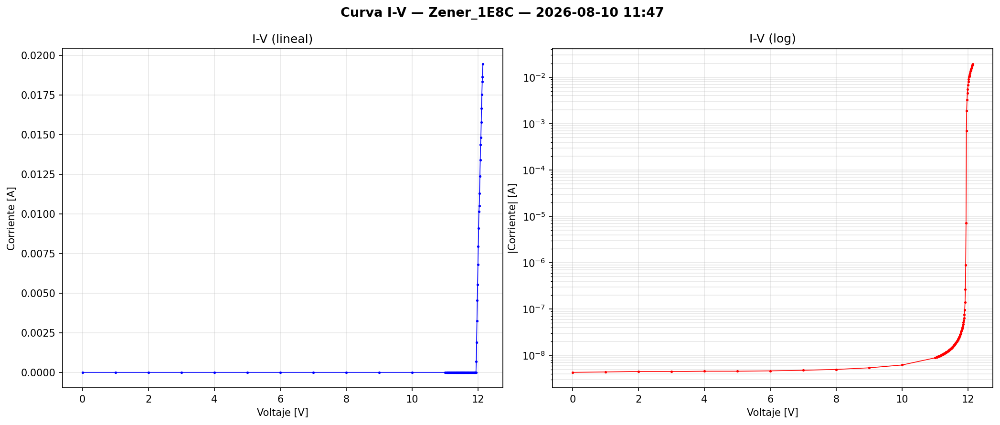
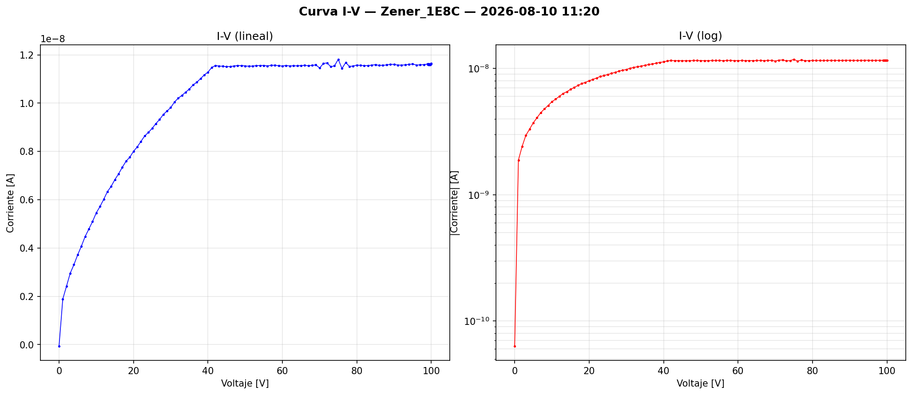
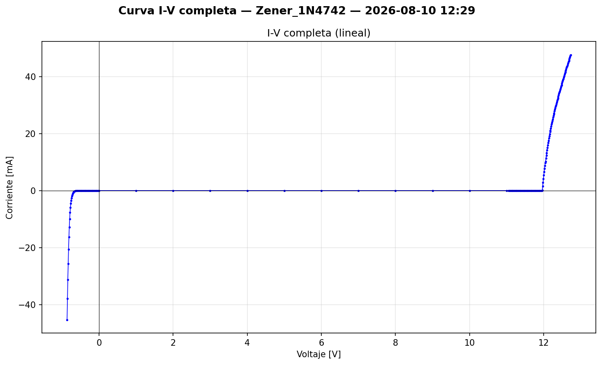
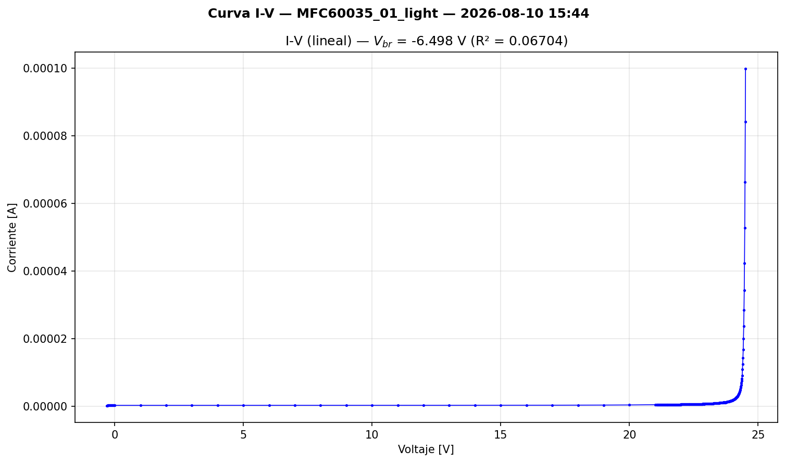
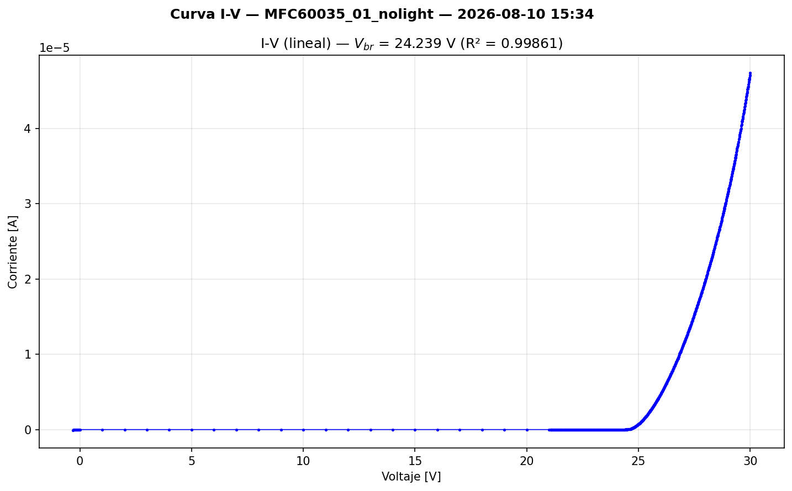
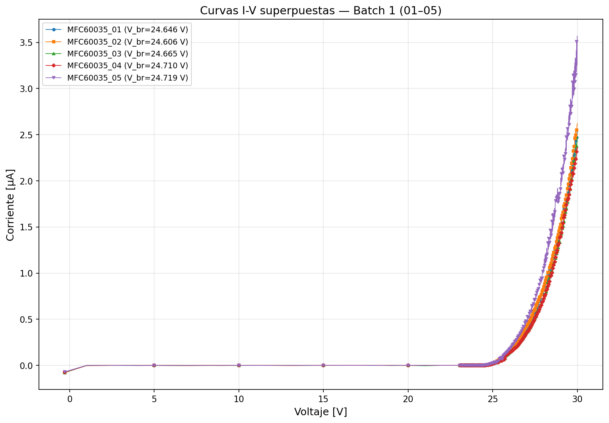

## Objetivo del día

Validar el procedimiento de medición I-V con un diodo zener y caracterizar el primer batch de 5 SiPMs MICROFC-60035-SMT para cuantificar la dispersión de V_br entre dispositivos.

---

## Contexto

- Setup validado el 2026-08-03 (ver LOG anterior): Keithley 2450 + Python + pyvisa-py.
- Modelo de SiPM confirmado por etiquetas de Mouser: **onsemi MICROFC-60035-SMT-TR** (C-Series, 6×6 mm, µcell 35 µm, V_br típico 24.2–24.7 V).
- Se dispone de 10 dispositivos del mismo modelo provenientes de dos órdenes de compra (STAN-2025 y STAN-2025-02, 5 unidades cada una). Hoy se midió el primer batch de 5.
- Se preparó previamente una guía de caracterización con protocolo, nomenclatura y criterios de aceptación (GUIA_Caracterizacion_IV_SiPMs.md).

---

## Trabajo realizado

### 1. Validación con diodo — componente "1E8C"

Se intentó medir un diodo supuestamente zener de 21–24 V (cilindro DO-41, marcado "1E8C"), como paso previo a los SiPMs.

**Mediciones realizadas:**

| Medición | Rango | Resultado |
|---|---|---|
| Inversa, 0–26 V | I ~ 9 nA, sin breakdown | No es zener de 24 V |
| Directa, 0–1.2 V, paso 10 mV | Exponencial con encendido ~0.6 V, compliance 5 mA a ~0.67 V | Diodo de silicio confirmado |
| Inversa, 0–35 V | I ~ 10 nA, saturando, sin breakdown | V_br > 35 V |
| Inversa, 0–100 V | I satura en ~12 nA a ~40 V, plana hasta 100 V | Rectificador, no zener |

**Conclusión:** el componente "1E8C" es un **diodo rectificador**, no un zener. La corriente inversa de saturación (~12 nA) y la ausencia de breakdown hasta 100 V son consistentes con un rectificador tipo 1N400x. Se confirmó con Fabri que, efectivamente, era un rectificador.

**Valor de la sesión:** a pesar de no ser el componente esperado, se validó que el setup mide correctamente corrientes desde pA hasta mA (rango de ~10 décadas), que los scripts funcionan correctamente, y que el procedimiento de medición es sólido.

### 2. Validación con diodo zener 1N4742

Se reemplazó por un **zener 1N4742** (V_Z = 12 V, I_ZM = 76 mA, P_max = 1 W).

**Medición: curva completa (directa + inversa) en un solo barrido:**

Se implementó un barrido en 3 fases usando voltajes negativos para directa y positivos para inversa (sin cambiar conexiones):

| Fase | Rango | Paso | Resultado |
|---|---|---|---|
| Fino directa | −0.8 → 0 V | 10 mV | Exponencial de diodo, compliance 50 mA a ~−0.67 V |
| Grueso medio | 1 → 8 V | 1 V | Corriente de fuga ~nA |
| Fino inversa | 8 → 15 V | 20 mV | Breakdown abrupto a ~11.8 V, compliance 50 mA alcanzado |

**Conexión:** cátodo (banda) → HI (+), ánodo → LO (−). Con esta convención, V < 0 polariza en directa y V > 0 en inversa.

**Conclusión:** el setup reproduce correctamente el breakdown de un zener conocido. La curva completa directa + inversa se obtuvo en un solo barrido, validando la capacidad del Keithley 2450 de operar en los 4 cuadrantes.

> [!WARNING] > Las mediciones de calibración/validación se sistemas no se guardan en el git, solo en drive/ssd.

### 2bis. Prueba preliminar: respuesta con luz vs oscuridad (MFC60035_01)

Antes de iniciar la campaña de caracterización, se realizaron dos mediciones del dispositivo #01 para verificar el efecto de la luz ambiente en la curva I-V.

| Medición | Archivo | Condición |
|---|---|---|
| Sin luz | `IV_MFC60035_01_nolight` | SiPM en la boveda cerrada y tapada de sabanas |
| Con luz | `IV_MFC60035_01_light` | SiPM en la boveda abierta, expuesta a la luz del laboratorio |

**Resultado esperado:** con luz, la fotocorriente se suma a la corriente oscura, desplazando la curva I-V hacia arriba (mayor corriente a un mismo voltaje). Esto puede sesgar la extracción de V_br si no se controla.

**Conclusión:** la medición confirma la necesidad de medir en oscuridad para obtener valores de V_br reproducibles y comparables entre dispositivos. Todas las mediciones de la campaña (MFC60035_01 a _05) se realizaron con el SiPM cubierto.

### 3. Caracterización de SiPMs — Batch 1 (5 dispositivos)

**Dispositivo:** onsemi MICROFC-60035-SMT (C-Series, 6×6 mm, 18980 µcells de 35 µm).

**Configuración del barrido:**

| Parámetro | Valor |
|---|---|
| Fase 1 (fino directa) | −0.8 → 0 V, paso 10 mV |
| Fase 2 (grueso) | 1 → 21 V, paso 1 V |
| Fase 3 (fino inversa) | 21.05 → 30 V, paso 50 mV |
| Compliance | 100 µA |
| NPLC | 1.0 |
| Delay por punto | 50 ms |
| Condición de luz | Oscuridad (cubierta opaca) |

**Resultados:**

> [!IMPORTANT] > Los archivos de estas mediciones se encuentran en: data/SiPM/raw/MFC60035/10-08-2026

 
| Dispositivo | V_br [V] | R² del ajuste |
|---|---|---|
| MFC60035_01 | 24.646 | 0.99495 |
| MFC60035_02 | 24.606 | — |
| MFC60035_03 | 24.665 | — |
| MFC60035_04 | 24.710 | — |
| MFC60035_05 | 24.709 | — |

**Dispersión:**

| Métrica | Valor |
|---|---|
| Media | 24.667 V |
| Desviación estándar | 44.3 mV |
| Rango (max − min) | 104 mV |
| Min | 24.606 V (#02) |
| Max | 24.710 V (#04) |

**Método de extracción de V_br:** ajuste lineal de √I vs V en la zona post-breakdown (método definido por onsemi en el datasheet, nota 3). El V_br es la intersección de la recta con el eje V (donde √I = 0).

**Observaciones:**
- Todos los V_br caen dentro del rango del datasheet (24.2–24.7 V).
- σ = 44.3 mV < 50 mV → cumple el criterio de aceptación para polarización compartida sin compensación individual por píxel.
- El rango de 104 mV implica que con un V_bias compartido, la variación máxima de V_ov entre dispositivos es ~0.1 V (4% para V_ov = 2.5 V).
- El dispositivo #05 muestra consistentemente mayor corriente a un mismo voltaje post-breakdown respecto a los otros 4. Posible DCR ligeramente mayor; no es problemático pero queda registrado.
- Se realizaron mediciones adicionales de #01 con y sin luz (MFC60035_01_light y MFC60035_01_nolight) como prueba preliminar antes de la campaña.

---

## Scripts utilizados

| Script                       | Función                                                               |
| ---------------------------- | --------------------------------------------------------------------- |
| `iv_curve_zener.py`          | Medición I-V del zener en inversa                                     |
| `iv_curve_zener_directa.py`  | Medición I-V del zener en directa (validación)                        |
| `iv_curve_zener_completa.py` | Medición I-V completa (directa + inversa, 3 fases)                    |
| `iv_curve_sipm_complete.py`  | Medición I-V de SiPM (3 fases, extracción automática de V_br)         |
| `comparar_iv_sipm.py`        | Superposición de curvas de los 5 dispositivos, análisis de dispersión |
|                              |                                                                       |
> [!IMPORTANT] >Los scripts relevantes para el PI son: `comparar_iv_sipm.py` y `iv_curve_sipm_complete.py`
---

## Archivos relevantes generados

Todos en la carpeta `SiPM/datos_iv/batch1_10-08`:

**SiPMs:**
- `IV_MFC60035_01_nolight_*.csv/.png` — #01 en oscuridad (prueba preliminar)
- `IV_MFC60035_01_light_*.csv/.png` — #01 con luz (prueba preliminar)
- `IV_MFC60035_01_*.csv/.png` — #01 medición de campaña
- `IV_MFC60035_02_*.csv/.png` — #02
- `IV_MFC60035_03_*.csv/.png` — #03
- `IV_MFC60035_04_*.csv/.png` — #04
- `IV_MFC60035_05_*.csv/.png` — #05

**Comparación:**
- `comparacion_IV_lineal.png` — 5 curvas I-V superpuestas
- `comparacion_sqrtI_Vbr.png` — √I vs V con ajustes y V_br marcados
- `dispersion_Vbr.png` — strip chart de V_br por dispositivo

---

## Decisiones técnicas de la sesión

- **Compliance 100 µA para SiPMs:** suficiente para capturar la zona post-breakdown (corrientes máximas medidas ~2.5 µA), 200× por debajo del máximo absoluto de 20 mA.
- **Compliance 50 mA para zener:** P = 12 V × 50 mA = 600 mW, dentro del máximo de 1 W.
- **Barrido en 3 fases:** fino en directa + grueso en el medio + fino en inversa. Permite capturar la curva completa con buena resolución donde importa sin desperdiciar tiempo en la zona de fuga.
- **NPLC = 1.0:** adecuado para la velocidad de la campaña. Se observa algo de ruido en la zona post-breakdown; evaluar NPLC más alto mañana.

---

## Pendientes del LOG anterior — estado

- [x] Confirmar modelo de SiPM → MICROFC-60035-SMT confirmado por etiquetas
- [x] Definir rangos seguros de voltaje y compliance → 0–30 V, 100 µA
- [x] Medición exploratoria del SiPM
- [x] Medición fina en la zona de breakdown
- [x] Medir en oscuridad
- [x] Renombrar SAMPLE_ID correctamente → MFC60035_01 a _05
- [ ] Evaluar si es necesario medir a distintas temperaturas → pendiente, pero se registra temperatura ambiente

---

## Pendientes para mañana (2026-08-11)

- [ ] Evaluar efecto de NPLC en la calidad de las mediciones (probar NPLC = 5 y 10 en un dispositivo y comparar ruido vs tiempo)
- [ ] Caracterizar el segundo batch de 5 SiPMs (MFC60035_06 a _10)
- [ ] Correr script de comparación con los 10 dispositivos
- [ ] Evaluar dispersión global (N=10) vs intra-batch
- [ ] Revisar si el rango del ajuste de √I vs V necesita acotarse (excluir cola alta para mejorar R²)
- [ ] Documentar temperatura ambiente de cada sesión

---

*Log generado al finalizar la sesión del 10 de agosto de 2026.*
