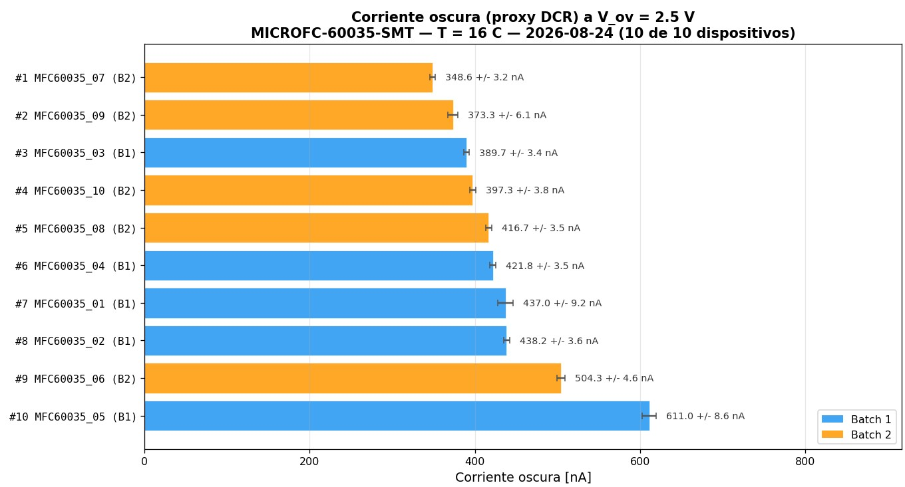
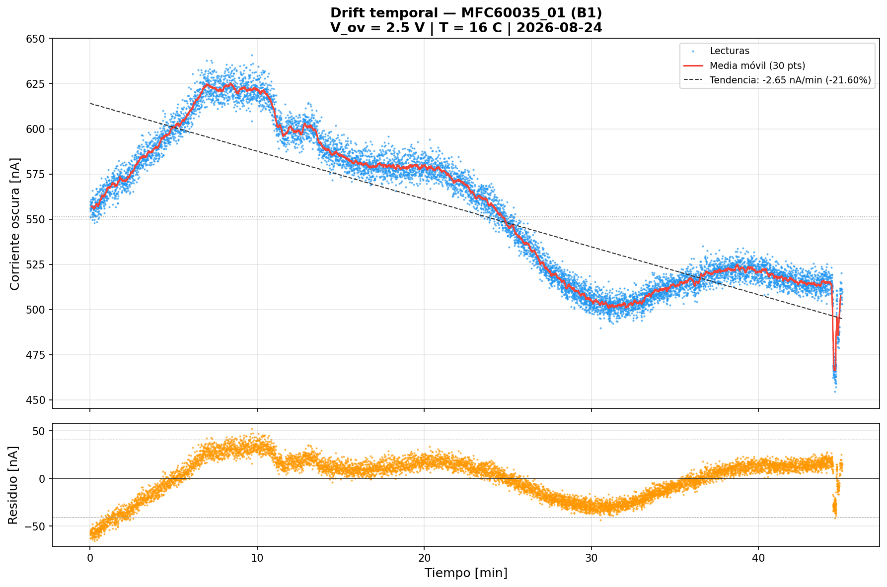
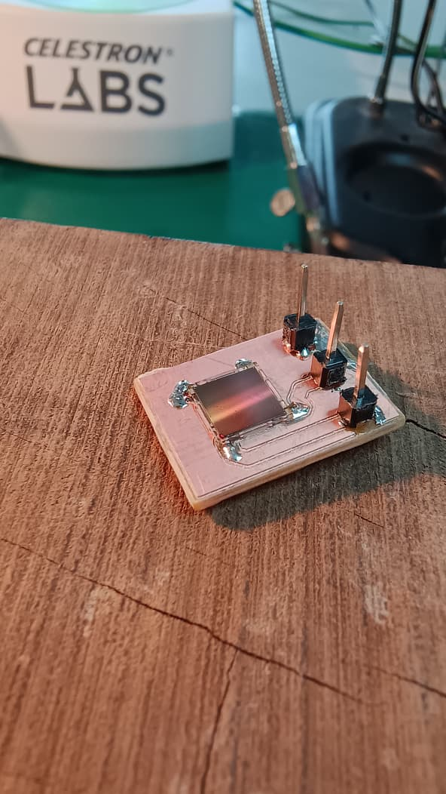

## Objetivo del día

Completar la caracterización eléctrica de los SiPMs MICROFC-60035-SMT mediante mediciones de corriente oscura (DCR) y estabilidad temporal, y planificar el setup térmico para la medición de dV_br/dT (Tarea 3). Adicionalmente, soldar el SiPM en la PCB breakout diseñada en la sesión anterior.

---

## Contexto

- **HITO 1 alcanzado el 11/08** (ver LOG 3): los 10 SiPMs fueron caracterizados por curva I-V y validados como aptos.
- En LOG 4 (18/08) se diseñó la PCB breakout en KiCad (Configuración A: cátodo = GND, bias negativo) y se envió a fabricar por fresado CNC.
- V_br de referencia para los 10 dispositivos medidos el 11/08 a 16 °C (LOG 3).
- Pendientes de LOGs anteriores: evaluar corriente oscura a V_ov fijo como indicador de DCR relativo entre dispositivos, verificar deriva de V_br (+55 mV en 40 min del experimento NPLC), y planificar medición de dV_br/dT a temperaturas controladas.
- El director indicó que se dispone de un sistema de watercooling (ID-COOLING), placas Peltier (TEC1-12706 y TEC1-12715), y una fuente ATX para armar el setup térmico.
- Temperatura ambiente de la sesión: **16 °C**.

---

## Trabajo realizado

### 1. Verificación de conexión VISA y estado del instrumento

Se verificó la comunicación con el Keithley 2450 usando `test_visa_connection.py`. Conexión USB (USBTMC) operativa, instrumento respondiendo correctamente.

### 2. Medición de corriente oscura (DCR) — 10 dispositivos

**Objetivo:** medir la corriente oscura de cada SiPM a V_ov = 2.5 V como proxy del DCR relativo, permitiendo comparar los dispositivos entre sí.

**Script utilizado:** `dcr_measure.py` v1.1

**Parámetros de medición:**

| Parámetro | Valor |
|---|---|
| V_bias | V_br(dispositivo) + 2.5 V |
| N muestras | 100 |
| Tiempo de estabilización | 10 s |
| NPLC | 1.0 |
| Compliance | 100 µA |
| Temperatura | 16 °C |
| Condición de luz | Oscuridad (cubierta opaca) |

Los V_br de referencia corresponden a las mediciones del 11/08 (LOG 3).

#### 2.1 Bug detectado y corregido en `dcr_measure.py`

Al tomar la segunda medición (dispositivo #01 tras #05), el gráfico de comparación mostraba barras en 0.0 nA para el dispositivo previamente medido.

**Causa raíz:** `csv.writer` entrecomillaba las líneas de metadatos que contenían comas (por ejemplo, la línea con el IDN del instrumento: `"# Instrumento: KEITHLEY,MODEL 2450,..."`). La función `load_previous_measurements()` encontraba una línea que empezaba con `"` en lugar de `#`, rompía el bucle de parseo de metadatos y nunca llegaba a leer el valor de `I_dark_mean_nA` → devolvía 0.0.

**Corrección (dos partes):**

1. **Writer:** se reemplazó `csv.writer.writerow()` por `f.write()` para las líneas de comentario/metadatos, evitando el entrecomillado automático.
2. **Reader:** se agregó stripping de comillas externas antes de verificar `startswith("#")`, para compatibilidad con CSVs ya generados:
   ```python
   if line.startswith('"') and line.endswith('"'):
       line = line[1:-1]
   ```

**Lección:** `csv.writer` aplica quoting según RFC 4180 a cualquier campo que contenga comas, puntos y coma, comillas o saltos de línea. Para líneas de comentario de texto libre (no tabulares), usar `f.write()` directamente.

#### 2.2 Resultados de los 10 dispositivos

| Dispositivo | Batch | I_dark [nA] | σ [nA] | CV [%] | V_bias [V] |
|---|---|---|---|---|---|
| #01 | 1 | 437.0 | 9.2 | 2.10 | 27.187 |
| #02 | 1 | 438.2 | 3.6 | 0.82 | 27.165 |
| #03 | 1 | 389.7 | 3.4 | 0.88 | 27.186 |
| #04 | 1 | 421.8 | 3.5 | 0.83 | 27.200 |
| #05 | 1 | 611.0 | 8.6 | 1.41 | 27.219 |
| #06 | 2 | 504.3 | 4.6 | 0.91 | 27.066 |
| #07 | 2 | 348.6 | 3.2 | 0.92 | 27.081 |
| #08 | 2 | 416.7 | 3.5 | 0.84 | 27.045 |
| #09 | 2 | 373.3 | 6.1 | 1.64 | 27.029 |
| #10 | 2 | 397.3 | 3.8 | 0.96 | 27.031 |



**Estadísticos globales:**

| Métrica | Valor |
|---|---|
| Media global | 433.8 nA |
| σ inter-dispositivo | 75.5 nA |
| CV inter-dispositivo | 17.4% |
| Rango | 262.4 nA (#07 → #05) |

**Comparación por batch:**

| Métrica | Batch 1 | Batch 2 |
|---|---|---|
| Media | 459.5 nA | 408.0 nA |
| σ | 85.9 nA | 59.4 nA |

**Outlier identificado:** el dispositivo #05 (611.0 nA) queda a +2.35σ de la media global. Si bien no supera el umbral estricto de 3σ, su corriente oscura es un 41% superior a la media y 75% mayor que el dispositivo más silencioso (#07). Puede indicar un defecto de fabricación o contaminación del chip.

**Nota:** estos 10 dispositivos son para caracterización y desarrollo del setup. Los SiPMs definitivos para la matriz del detector se comprarán por separado (lote de ~100 unidades).

**Estimación de DCR a partir de I_dark:**
Usando la relación I_dark = DCR × Gain × q, con Gain ≈ 3×10⁶ (a V_ov = 2.5 V, datasheet) y q = 1.6×10⁻¹⁹ C:

DCR ≈ I_dark / (Gain × q) = 433.8 nA / (3×10⁶ × 1.6×10⁻¹⁹) ≈ 903 kHz

Rango esperable a 21 °C (datasheet): 50 kHz – 1 MHz. Nuestro valor (~903 kHz a 16 °C) está en el extremo alto pero dentro de especificación, consistente con que el datasheet reporta valores típicos a 21 °C y el DCR disminuye ~7%/°C con la temperatura.

### 3. Medición de estabilidad temporal (drift) — Dispositivo #01

**Objetivo:** verificar la estabilidad de la corriente oscura a V_ov fijo durante un período prolongado (45 min), cuantificar la deriva y evaluar si el setup es suficientemente estable para mediciones sostenidas.

**Script utilizado:** `drift_temporal.py` v1.0

**Parámetros:**

| Parámetro | Valor |
|---|---|
| Dispositivo | MFC60035_01 |
| V_bias | V_br + 2.5 V = 27.187 V |
| Duración | 45 min |
| Intervalo de muestreo | ~2 s |
| NPLC | 1.0 |
| Compliance | 100 µA |

**Resultado:**



El comportamiento observado fue **no lineal**, con tres fases distinguibles:

1. **Fase de ascenso** (0–10 min): corriente sube de ~550 nA a ~625 nA.
2. **Fase de descenso** (10–35 min): corriente baja gradualmente hasta ~500 nA.
3. **Fase de plateau** (35–44 min): corriente se estabiliza en ~510–520 nA, con un pico al final.

El ajuste lineal global arrojó −2.65 nA/min (−21.6%), pero este valor es engañoso porque el comportamiento no es lineal.

**Observaciones:** la temperatura ambiente se mantuvo en 16 °C durante toda la medición (verificado con termómetro), por lo que la deriva térmica no explica el comportamiento. La causa de este comportamiento no lineal **queda pendiente de discusión con el director**.

### 4. Planificación del setup térmico — Tarea 3 (dV_br/dT)

**Objetivo:** diseñar un setup para variar la temperatura del SiPM de forma controlada y medir el coeficiente de temperatura del voltaje de breakdown.

**Valor de referencia (datasheet onsemi):** 21.5 mV/°C
**Valor de referencia (Taggart et al., SensL MicroFC):** 17.7 ± 0.9 mV/°C

Se elaboró un plan detallado (`plan_setup_termico_T3.md`) que cubre:

**Equipamiento disponible:**

| Componente | Modelo |
|---|---|
| Peltier 1 | TEC1-12715 (15A, 12V) |
| Peltier 2 | TEC1-12706 (6A, 12V) |
| Watercooling | ID-COOLING (sistema completo: bloque, bomba, radiador, ventiladores) |
| Fuente ATX | Thermaltake TR700CNUSRF000721 (alimentación watercooling) |
| Fuente regulable | De laboratorio (alimentación Peltier) |
| Sensor de temperatura | DS18B20 (1-Wire, 0.0625 °C en 12 bits) + Arduino |
| Pasta térmica | MX-4 Arctic (no eléctricamente conductiva) |

**Stack térmico (de abajo hacia arriba):**
```
Bloque watercooling (ID-COOLING)
  ↕ MX-4
Peltier(s) (lado caliente abajo)
  ↕ MX-4
Placa fría (aluminio ~40×40×3 mm)
  ↕ MX-4
SiPM + DS18B20 (sensor de temperatura)
  ↕
Cubierta opaca + aislante + silica gel
```

**Sensor de temperatura:** DS18B20 digital, protocolo 1-Wire, resolución 0.0625 °C en modo 12 bits, conectado a Arduino. Se descartó el termómetro Zotek ZT102 (resolución de solo 1 °C, insuficiente para medir variaciones de décimas).

#### 4.1 Evaluación del setup existente (cámara de niebla)

El laboratorio ya tenía un montaje en cascada de dos Peltier (TEC1-12715 sobre TEC1-12706 sobre el watercooling), usado previamente como cámara de niebla. Se evaluó su reutilización:

**Cambios necesarios:**
- Reemplazar el papel aluminio negro por una placa de aluminio plana (~40×40 mm) como spreader térmico.
- Agregar cubierta opaca + silica gel.
- Conectar el DS18B20 sobre la placa fría, cerca del SiPM.

**Componentes reutilizables:** bloque de watercooling, bomba + radiador + ventiladores, fuente ATX, ambas Peltier, pasta térmica MX-4, montaje mecánico existente.

### 5. PCB breakout — Fabricación y soldadura del SiPM

La placa breakout diseñada en LOG 4 fue fabricada por fresado CNC.

**Primera versión:** la fresadora cortó mal — los surcos de aislación quedaron irregulares. Se descartó esta placa.

**Segunda versión:** se repitió el fresado y la placa salió limpia, con surcos bien definidos y pistas correctas.

**Soldadura:** se soldó el SiPM MICROFC-60035-SMT y los conectores pin header. Se verificó continuidad entre los pines del SiPM y los conectores correspondientes — todo correcto.



**Estado:** la placa está lista para la primera prueba eléctrica (medición de pulsos con osciloscopio, programada para la próxima sesión).

---

## Decisiones técnicas de la sesión

- **`f.write()` en lugar de `csv.writer` para metadatos en CSV:** evita el problema de quoting de RFC 4180. Los datos tabulares siguen usando `csv.writer`; solo las líneas de comentario (`# ...`) cambian a escritura directa.
- **Arduino + DS18B20 sobre Zotek ZT102:** resolución 64× superior (0.0625 °C vs 1 °C), registro automático por serial, y posibilidad de integración con el script de medición I-V.
- **Reutilización del montaje de cámara de niebla:** el stack existente (watercooling + Peltier en cascada) se puede adaptar para la Tarea 3 con cambios mínimos (placa de aluminio como spreader, cubierta opaca, sensor DS18B20).

---

## Scripts utilizados / generados

| Script | Función | Estado |
|---|---|---|
| `test_visa_connection.py` | Verificación de comunicación VISA con Keithley 2450 | Sin cambios |
| `dcr_measure.py` | Medición de I_dark a V_ov fijo (100 muestras, comparación multi-dispositivo) | **v1.1** — fix de csv.writer quoting |
| `dcr_analysis.py` | Análisis comparativo de 10 mediciones DCR (stats, estimación de DCR) | **Nuevo** |
| `drift_temporal.py` | Monitoreo continuo de I_dark durante 45 min (moving average, trend, residuos) | **Nuevo** |

**Cambios en `dcr_measure.py` v1.1:**
- Writer: líneas de metadatos con `f.write()` en lugar de `csv.writer.writerow()`.
- Reader (`load_previous_measurements()`): stripping de comillas externas antes de `startswith("#")`.
- Sin cambios en la lógica de medición ni en los parámetros.

---

## Archivos generados

**Mediciones DCR:**
- `datos_dcr/DCR_MFC60035_01_*.csv` — DCR dispositivo #01
- `datos_dcr/DCR_MFC60035_02_*.csv` — DCR dispositivo #02
- `datos_dcr/DCR_MFC60035_03_*.csv` — DCR dispositivo #03
- `datos_dcr/DCR_MFC60035_04_*.csv` — DCR dispositivo #04
- `datos_dcr/DCR_MFC60035_05_*.csv` — DCR dispositivo #05
- `datos_dcr/DCR_MFC60035_06_*.csv` — DCR dispositivo #06
- `datos_dcr/DCR_MFC60035_07_*.csv` — DCR dispositivo #07
- `datos_dcr/DCR_MFC60035_08_*.csv` — DCR dispositivo #08
- `datos_dcr/DCR_MFC60035_09_*.csv` — DCR dispositivo #09
- `datos_dcr/DCR_MFC60035_10_*.csv` — DCR dispositivo #10
- Gráfico de comparación de barras (10 dispositivos)

**Drift temporal:**
- `datos_drift/DRIFT_MFC60035_01_*.csv` — datos crudos (45 min, ~1350 muestras)
- `datos_drift/DRIFT_MFC60035_01_*.png` — gráfico de dos paneles (corriente + residuos)

**Documentación:**
- `plan_setup_termico_T3.md` — plan completo del setup térmico para Tarea 3

---

## Pendientes del LOG anterior (18/08) — estado

- [ ] Revisar si el rango del ajuste de √I vs V necesita acotarse → pendiente
- [x] Evaluar corriente oscura a V_ov fijo como indicador de DCR relativo entre dispositivos → **completado** (10 dispositivos medidos y comparados)
- [x] Verificar si la deriva de V_br observada en el experimento NPLC (+55 mV en 40 min) se estabiliza → **parcial**: el drift temporal de 45 min muestra comportamiento no lineal a temperatura constante. Causa pendiente de discusión con el director.
- [ ] Definir criterio de selección de dispositivos para la matriz → pendiente (los SiPMs definitivos se comprarán por separado)
- [x] Planificar medición de dV_br/dT a temperaturas controladas → **completado** (plan_setup_termico_T3.md)
- [x] Recibir la placa fabricada y soldar el SiPM → **completado** (segunda versión de CNC, soldadura OK, continuidad verificada)
- [ ] Verificar dimensiones del footprint de SnapEDA contra el plano mecánico oficial → pendiente
- [ ] Crear el footprint a mano como ejercicio de verificación → pendiente
- [ ] Definir el modelo del amplificador RF para la fast output → pendiente
- [x] Adaptar los scripts de medición I-V a la nueva convención de polaridad (Config A) → completado en LOG 4 (`iv_curve_sipm_complete_v3.py`)
- [ ] Evaluar si la placa necesita revisión futura con conector SMA para fast output → pendiente

---

## Pendientes

- [ ] Probar la PCB breakout: medir curva I-V con Config A y verificar que `iv_curve_sipm_complete_v3.py` funcione correctamente
- [ ] Medir pulsos del SiPM con osciloscopio a través de la fast output (J2)
- [ ] Repetir medición de drift temporal con SiPM soldado en PCB
- [ ] Escribir sketch de Arduino para logging de temperatura (`temp_logger.ino` — DS18B20, 12 bits, serial 115200)
- [ ] Escribir script integrado `thermal_iv_sweep.py` (lectura de Arduino + control de Keithley para barrido térmico)
- [ ] Armar el setup térmico completo (según plan_setup_termico_T3.md)
- [ ] Ejecutar Tarea 3: barrido de 6 puntos de temperatura (10–35 °C), medir dV_br/dT
- [ ] Consultar al director sobre el comportamiento no lineal del drift temporal
- [ ] Revisar si el rango del ajuste de √I vs V necesita acotarse
- [ ] Verificar dimensiones del footprint de SnapEDA contra plano mecánico oficial
- [ ] Definir modelo del amplificador RF para fast output

---

## Referencias consultadas

- **DataSheet MICROC-SERIES/D** — C-Series SiPM Sensors datasheet. Valores de referencia de DCR y dV_br/dT.
- **AND9782/D** — Biasing and Readout of ON Semiconductor SiPM Sensors. Configuraciones de bias.
- **Taggart et al.** — Medición de dV_br/dT = 17.7 ± 0.9 mV/°C en SensL MicroFC (modelo anterior).
- **DS18B20 datasheet** — Maxim/Analog Devices. Resolución, protocolo 1-Wire, configuración de 12 bits.
- **TEC1-12706 datasheet** — Especificaciones de la celda Peltier (Vmax = 15.4 V, Imax = 6 A, ΔTmax = 66 °C).

---

*Log generado al finalizar la sesión del 24 de agosto de 2026.*