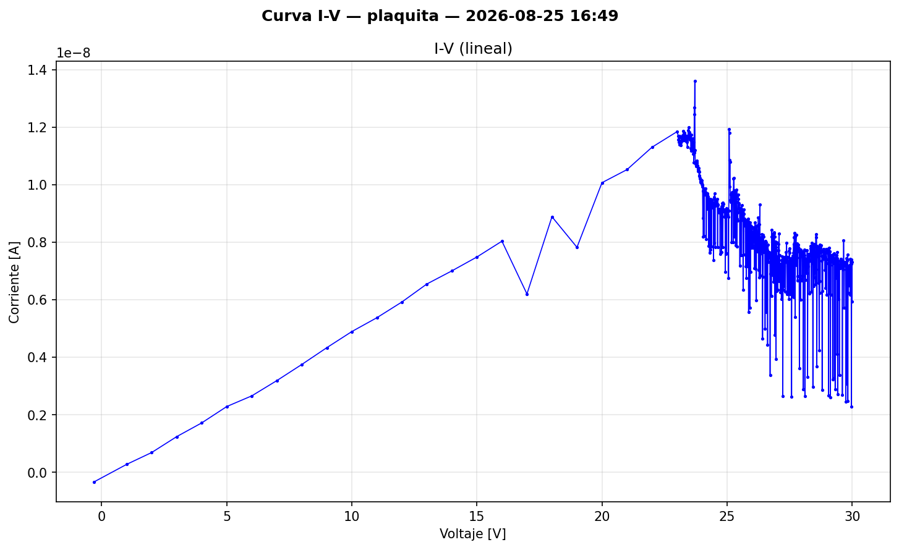
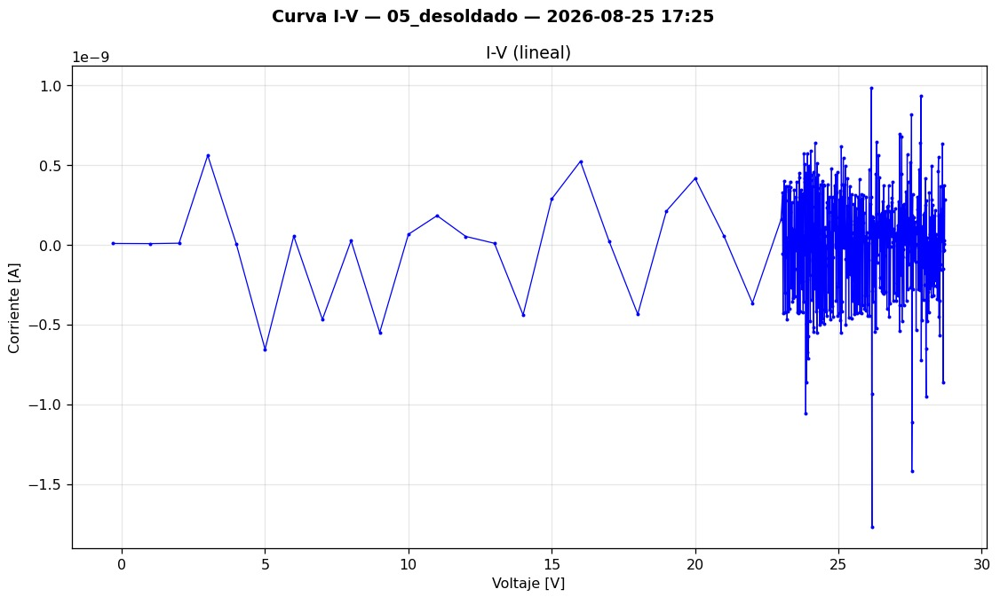
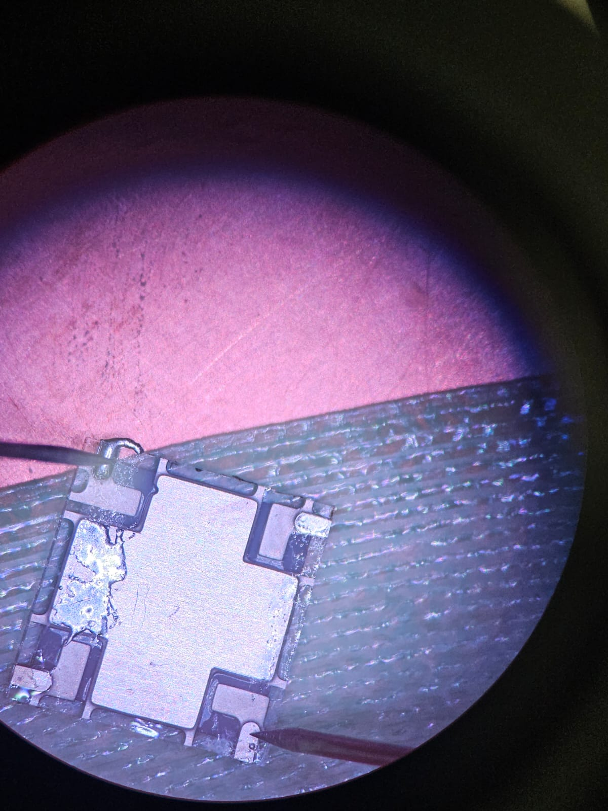

## Objetivo del día

Medir los pulsos (dark counts) del SiPM #05 (MFC60035_05) mediante la fast output (J2) de la PCB breakout diseñada y fabricada en la sesión anterior, observándolos en el osciloscopio. Para ello, se creó un script de bias DC que aplica un voltaje estable al SiPM a través del Keithley 2450 SMU.

---

## Contexto

- En LOG 5 (24/08) se completó la fabricación de la PCB breakout (segunda versión de CNC), se soldó el SiPM #05 y se verificó continuidad. La placa quedó lista para la primera prueba eléctrica.
- Configuración A (AND9782/D): cátodo = GND (J3), ánodo = −Vbias (J1), fast output referenciada a 0V (J2).
- V_br del dispositivo #05: 24.719 V (medido el 11/08/2026 a 16 °C, LOG 3).
- I_dark del dispositivo #05 a V_ov = 2.5 V: 611.0 nA (medida el 24/08 a 16 °C, LOG 5) — el valor más alto de los 10 dispositivos (+2.35σ de la media global).
- Pendiente de LOG 5: medir pulsos del SiPM con osciloscopio a través de la fast output (J2) — objetivo principal de esta sesión.

---

## Trabajo realizado

### 1. Creación del script de bias DC (`bias_sipm_05.py`)

**Objetivo:** aplicar un voltaje de bias DC estable al SiPM #05 para observar pulsos en el osciloscopio, permitiendo al usuario elegir la V_ov (sobretensión por encima de V_br).

**Estructura del script — 7 pasos secuenciales:**

1. **Checklist de conexiones:** verificación interactiva de las conexiones físicas (SMU HI → J1, SMU LO → J3, osciloscopio → J2, GND compartida).
2. **Entrada de V_ov:** el usuario elige el voltaje de sobretensión. Rango recomendado: 0.5–5.0 V (datasheet). Bloqueo duro en 7.0 V.
3. **Validación de seguridad:** cálculo de V_source = −(V_br + V_ov), verificación contra I_max absoluta (20 mA) y V_bias máximo (32 V).
4. **Confirmación explícita:** resumen de parámetros con solicitud de confirmación antes de aplicar tensión.
5. **Configuración del instrumento con readback:** configura el Keithley 2450 y verifica 9 parámetros por readback (source function, source range, source level, output off state, current compliance, sense function, NPLC, auto-zero, terminal).
6. **Rampa gradual:** sube el voltaje en pasos de 1.0 V con verificación de corriente en cada escalón (protección contra transitorios y detección de cortocircuito a 0 V).
7. **Monitoreo continuo:** muestra |I| cada 2 s hasta que el usuario presiona Ctrl+C.

**Parámetros clave del script:**

| Parámetro | Valor | Justificación |
|---|---|---|
| V_BR | 24.719 V | Medido 11/08 a 16 °C (LOG 3) |
| I_COMPLIANCE | 100 µA | 200× por debajo de I_max (20 mA) |
| V_OV_MAX_SOFT | 5.0 V | Límite superior recomendado (datasheet) |
| V_OV_MAX_HARD | 7.0 V | Bloqueo absoluto del script |
| V_RAMP_STEP | 1.0 V | Paso de la rampa |
| V_RAMP_DELAY | 0.3 s | Delay entre pasos |
| SETTLING_TIME | 2.0 s | Estabilización post-rampa |
| MONITOR_INTERVAL | 2.0 s | Intervalo de lectura de corriente |

**Protecciones implementadas:**
- Handler de Ctrl+C (signal.SIGINT) con rampa de apagado seguro.
- Verificación de corriente a 0 V antes de la rampa (detección de cortocircuito).
- Fallback de 3 niveles en el shutdown: (1) rampa descendente, (2) `OUTPut OFF`, (3) `*RST` del instrumento.
- Usa `:READ?` en lugar de `:MEAS:CURR?` para evitar reconfigurar la función de sensado (bug documentado en LOG 1).

**Justificación de la rampa gradual:** aunque la rampa no es estrictamente necesaria para un SiPM (la corriente post-breakdown es del orden de µA), fue incluida como buena práctica de instrumentación por tres razones: (1) permite detectar un cortocircuito antes de alcanzar V_bias pleno, (2) evita transitorios que podrían disparar el compliance innecesariamente, y (3) si se reutiliza el script para otros dispositivos, la protección ya está implementada.

### 2. Intento de medición de pulsos — Sin resultado

Se ejecutó el script `bias_sipm_05.py` con distintos valores de V_ov (hasta 5.0 V). **No se observaron pulsos en el osciloscopio.** Solo se detectó ruido de fondo.

Se intentó identificar si el ruido provenía de la placa amplificadora o del SiPM, sin éxito claro en primera instancia.

### 3. Troubleshooting sistemático — Secuencia de aislamiento

Ante la ausencia total de señal, se procedió a un troubleshooting por etapas, aislando progresivamente las posibles fuentes de fallo:

**Paso 1 — Setup completo (PCB + amplificador + osciloscopio):**
No se observaron pulsos. Solo ruido.

**Paso 2 — Separación del amplificador:**
Se aisló la PCB breakout del amplificador para determinar si el ruido era generado por el amplificador o por el SiPM. Resultado inconcluso.

**Paso 3 — Retorno al setup de agujas (curva I-V en la plaquita):**
Se conectaron las agujas de contacto a los pines de la PCB breakout y se realizó un barrido I-V completo (0–30 V). La curva obtenida (ver figura) muestra un comportamiento radicalmente distinto al esperado:

| Zona | Comportamiento esperado (SiPM sano) | Comportamiento observado |
|---|---|---|
| Pre-breakdown (0–24 V) | Corriente de fuga plana, sub-nA (~0.1–1 nA) | **Aumento lineal (óhmico)** de ~0 a ~12 nA |
| Breakdown (~24.7 V) | Rodilla abrupta, inicio de avalancha | **Sin rodilla de breakdown** — solo un pico ruidoso a ~14 nA |
| Post-breakdown (>25 V) | Corriente creciente, ~611 nA a V_ov = 2.5 V | **Corriente ruidosa y descendente**, oscilando entre ~3–10 nA |

**Análisis de la curva:**
- La corriente máxima medida es ~14 nA (1.4 × 10⁻⁸ A) — unas **44× menor** que los 611 nA esperados a V_ov = 2.5 V para este dispositivo.
- El aumento lineal pre-breakdown corresponde a un comportamiento **óhmico**, con resistencia equivalente R ≈ 24 V / 12 nA ≈ 2 GΩ. Como se confirmó en el Paso 5 (SiPM desoldado = circuito abierto), esta corriente no pasa por el SiPM sino por la **PCB misma** (fuga parásita a través del substrato FR4 o contaminación superficial).
- La **ausencia total de la rodilla de breakdown** confirma que el mecanismo de avalancha de las 18980 microceldas no existe.
- El ruido elevado post-24 V (fluctuaciones de ±50% del valor medio) es consistente con el Keithley operando cerca del piso de ruido en autorange para corrientes de ~10 nA.

**Paso 4 — Medición directa sobre los pads del SiPM:**
Se posicionaron las agujas directamente sobre los pads del SiPM en la PCB, eliminando la posibilidad de un problema de conexión entre el SiPM y las pistas. **Resultado idéntico: solo corriente de fuga, sin breakdown.**

**Paso 5 — SiPM desoldado:**
Se desoldó el SiPM #05 de la PCB y se midió de forma independiente. La curva obtenida (ver figura) muestra que el dispositivo es esencialmente un **circuito abierto**:

- Escala: 10⁻⁹ A.
- La corriente **oscila alrededor de cero** en todo el rango de 0–30 V: ±0.5 nA pre-23 V, ±1.5 nA post-23 V.
- No hay corriente neta positiva ni negativa — es **puro ruido del instrumento** en el piso de medición.
- No hay absolutamente ninguna evidencia de unión p-n, ni de comportamiento de diodo, ni de breakdown.

**Comparación plaquita vs. desoldado:**

| Medición | Escala | Corriente a 24 V | Interpretación |
|---|---|---|---|
| En plaquita (16:49) | 10⁻⁸ A | ~12 nA (óhmica, creciente) | Fuga parásita a través de la PCB (~2 GΩ) |
| Desoldado (17:25) | 10⁻⁹ A | ~0 nA (ruido centrado en cero) | SiPM = circuito abierto |

**Hallazgo adicional:** la corriente óhmica observada en la medición con la plaquita (~12 nA a 24 V) **no pasaba por el SiPM** sino por la PCB misma (camino parásito a través del substrato FR4 o contaminación superficial). Al remover el SiPM y medirlo aislado, la corriente cayó a cero, confirmando que el dispositivo está muerto y que la PCB tiene una fuga parásita propia del orden de ~2 GΩ. Esta fuga de la PCB es irrelevante para la operación normal (12 nA << 611 nA de I_dark esperada), pero es importante tenerla identificada para no confundirla con señal del SiPM en futuros diagnósticos.

**Conclusión del troubleshooting:** el SiPM #05 está destruido. Dos mediciones independientes lo confirman de forma inequívoca: la plaquita muestra solo la fuga parásita de la PCB (sin breakdown), y el SiPM desoldado se comporta como un circuito abierto (corriente = ruido del instrumento).

> [!CAUTION]
> 🫡 **Press F** por el primer componente destruido en el PI.
>

### 4. Análisis de causa raíz — Daño térmico por soldadura

Al revisar las condiciones de soldadura y las especificaciones del fabricante, se identificó la causa de la destrucción:

| Parámetro | Especificación (datasheet) | Valor real aplicado |
|---|---|---|
| Temperatura máxima | 260 °C | **350 °C** |
| Tiempo máximo | 10 s | **~60 s** |

**Fuente de la especificación:** el datasheet MICROC-SERIES/D (onsemi, Rev. 9) indica en Table 3 (Package Parameters) que las condiciones de soldadura son "Lead-free, reflow soldering process compatible" con referencia al SMT Handling Tech Note, que especifica un máximo de 260 °C por 10 segundos para soldadura manual.

**Excedencia:** la soldadura se realizó a **350 °C durante aproximadamente 1 minuto**, lo cual excede la temperatura máxima en 90 °C (+35%) y el tiempo máximo en 50 s (6× el límite).

**Mecanismo de daño probable:** a 350 °C, la temperatura en la unión p-n del SiPM supera ampliamente el límite de supervivencia del silicio dopado. Los posibles mecanismos incluyen:
- Difusión acelerada de dopantes en las uniones p-n de las microceldas, destruyendo la estructura de avalancha.
- Degradación del encapsulante de moldeo (compuesto de transferencia transparente, n = 1.59 @ 420 nm).
- Daño en las interconexiones internas (wire bonds o metalización).
- Estrés termomecánico en la interfaz chip-encapsulado.

**Correlación con la literatura:** el paper TrueInvivo (proyecto del mismo grupo, Taggart et al.) reporta que la exposición de un SiPM C-Series a temperaturas de soldador por encima de ~275–300 °C produce un incremento significativo de corriente de fuga y degradación de la respuesta espectroscópica, con un efecto de umbral. A 350 °C, el espectro gamma se vuelve irreconocible. Nuestro resultado es consistente con un daño más severo (exposición directa por contacto térmico durante la soldadura, no solo proximidad radiativa como en el paper).

### 5. Estado del inventario de SiPMs

| Dispositivo | Estado | Notas |
|---|---|---|
| MFC60035_01 | ✅ Apto | Batch 1, V_br = 24.687 V |
| MFC60035_02 | ✅ Apto | Batch 1, V_br = 24.665 V |
| MFC60035_03 | ✅ Apto | Batch 1, V_br = 24.686 V |
| MFC60035_04 | ✅ Apto | Batch 1, V_br = 24.700 V |
| MFC60035_05 | ❌ **Destruido** | Batch 1, daño térmico por soldadura (25/08) |
| MFC60035_06 | ✅ Apto | Batch 2, V_br = 24.566 V |
| MFC60035_07 | ✅ Apto | Batch 2, V_br = 24.581 V |
| MFC60035_08 | ✅ Apto | Batch 2, V_br = 24.545 V |
| MFC60035_09 | ✅ Apto | Batch 2, V_br = 24.529 V |
| MFC60035_10 | ✅ Apto | Batch 2, V_br = 24.531 V |

**Quedan 9 dispositivos aptos para el proyecto** (4 del batch 1, 5 del batch 2).

---

## Decisiones técnicas de la sesión

- **Uso de `:READ?` en lugar de `:MEAS:CURR?`:** se mantiene la convención establecida en LOG 1, ya que `:MEAS:CURR?` reconfigura la función de sensado y puede alterar el estado del instrumento durante el monitoreo continuo.
- **Rampa de voltaje en el script de bias:** incluida como protección estándar, a pesar de que no es crítica para las corrientes típicas de operación del SiPM. Se priorizó la seguridad del instrumento y la detección temprana de fallos.

---

## Lecciones aprendidas

### Soldadura de SiPMs MICROFC-60035-SMT — Perfil térmico obligatorio

**Esta es la lección más importante de la sesión y debe considerarse un protocolo permanente del proyecto.**

1. **Temperatura máxima de soldadura: 260 °C.** No exceder bajo ninguna circunstancia.
2. **Tiempo máximo de contacto térmico: 10 segundos.** Incluye el tiempo total desde que la punta del soldador toca el pad hasta que se retira.
3. **Recomendaciones para la próxima soldadura:**
   - Configurar la estación de soldadura a **250 °C** (margen de 10 °C respecto al máximo).
   - Usar punta fina de contacto mínimo.
   - Pre-estañar los pads del PCB antes de colocar el SiPM.
   - Aplicar el soldador brevemente (2–3 s por pad) y permitir que el dispositivo se enfríe entre pads.
   - Si es posible, usar pasta de soldadura y aire caliente a temperatura controlada en lugar de soldador de contacto.
   - Medir la curva I-V inmediatamente después de soldar para verificar que el dispositivo no fue dañado.
4. **Criterio de verificación post-soldadura:** una curva I-V que muestre una rodilla de breakdown a ~24.5–24.7 V con corriente post-breakdown creciente (centenas de nA a V_ov = 2.5 V) confirma que el dispositivo está funcional. Una curva con comportamiento óhmico (corriente lineal de ~nA sin rodilla de breakdown, como la obtenida en esta sesión) indica destrucción.

---

## Scripts utilizados / generados

| Script | Función | Estado |
|---|---|---|
| `bias_sipm_05.py` | Bias DC del SiPM para medición de pulsos (7 pasos, monitoreo continuo, shutdown seguro) | **Nuevo** — funcional pero el dispositivo destino (#05) está destruido |

**Nota sobre reutilización:** el script `bias_sipm_05.py` es reutilizable para otros dispositivos cambiando únicamente las constantes `DEVICE_ID`, `V_BR` e `I_DARK_EXPECTED_nA`. La estructura, protecciones y lógica de control son genéricas.

---

## Archivos generados

- `bias_sipm_05.py` — Script de bias DC (~890 líneas, completo y documentado).
- Curva I-V de diagnóstico del SiPM #05 en la plaquita (barrido 0–30 V, 2026-08-25 16:49) — comportamiento óhmico, sin breakdown. Corriente máxima ~14 nA (escala 10⁻⁸ A).
- Curva I-V del SiPM #05 desoldado (barrido 0–30 V, 2026-08-25 17:25) — circuito abierto, corriente = ruido del instrumento (escala 10⁻⁹ A).

No se generaron archivos de datos de pulsos: el dispositivo estaba destruido antes de que las mediciones pudieran realizarse.

---

## Pendientes del LOG anterior (24/08) — estado

- [x] Medir pulsos del SiPM con osciloscopio a través de la fast output (J2) → **BLOQUEADO**: dispositivo #05 destruido. Requiere soldar un nuevo SiPM.
- [ ] Repetir medición de drift temporal con SiPM soldado en PCB → pendiente (requiere nuevo SiPM soldado)
- [ ] Escribir sketch de Arduino para logging de temperatura (`temp_logger.ino`) → pendiente
- [ ] Escribir script integrado `thermal_iv_sweep.py` → pendiente
- [ ] Armar el setup térmico completo (según plan_setup_termico_T3.md) → pendiente
- [ ] Ejecutar Tarea 3: barrido de 6 puntos de temperatura → pendiente
- [ ] Consultar al director sobre el comportamiento no lineal del drift temporal → pendiente
- [ ] Revisar si el rango del ajuste de √I vs V necesita acotarse → pendiente
- [ ] Verificar dimensiones del footprint de SnapEDA contra plano mecánico oficial → pendiente
- [ ] Definir modelo del amplificador RF para fast output → pendiente

---

## Pendientes

- [ ] **URGENTE: Soldar un nuevo SiPM en la PCB breakout con perfil térmico correcto** (≤250 °C, ≤10 s por pad). Seleccionar el dispositivo de reemplazo entre los 9 restantes.
- [ ] Verificar post-soldadura con curva I-V inmediata (criterio: breakdown visible a ~24.5–24.7 V)
- [ ] Reintentar medición de pulsos (dark counts) en el osciloscopio vía fast output (J2)
- [ ] Adaptar `bias_sipm_05.py` al nuevo dispositivo (cambiar V_BR, DEVICE_ID, I_DARK_EXPECTED_nA)
- [ ] Repetir medición de drift temporal con SiPM soldado en PCB
- [ ] Escribir sketch de Arduino para logging de temperatura (`temp_logger.ino`)
- [ ] Armar el setup térmico completo y ejecutar Tarea 3 (dV_br/dT)
- [ ] Consultar al director sobre el comportamiento no lineal del drift temporal
- [ ] Verificar dimensiones del footprint de SnapEDA contra plano mecánico oficial
- [ ] Definir modelo del amplificador RF para fast output

---

## Nota sobre el dispositivo #05

El dispositivo MFC60035_05 fue el que presentaba la mayor corriente oscura de los 10 dispositivos (611 nA, +2.35σ de la media global de 434 nA — LOG 5). Queda registrado que **ese valor de I_dark elevado era una propiedad intrínseca del dispositivo, no un indicador de daño previo**: las mediciones DCR se realizaron el 24/08 con las agujas de contacto, cuando el SiPM aún no había sido soldado. La destrucción ocurrió exclusivamente durante el proceso de soldadura en la PCB breakout entre las sesiones del 24 y 25 de agosto.

---

## Referencias consultadas

- **DataSheet MICROC-SERIES/D** (onsemi, Rev. 9, Feb. 2022) — Table 3: Package Parameters, condiciones de soldadura.
- **AND9782/D** — Biasing and Readout of ON Semiconductor SiPM Sensors. Configuración A.
- **TrueInvivo (Taggart et al.)** — Sección 3.2: efecto de exposición a fuente de calor externa sobre SiPM C-Series. Efecto de umbral a ~275–300 °C.

---

*Log generado al finalizar la sesión del 25 de agosto de 2026.*
