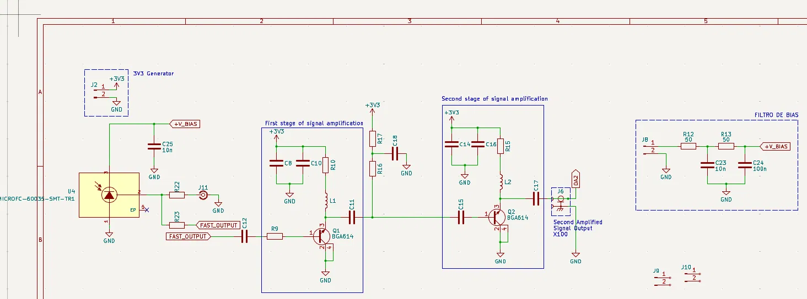
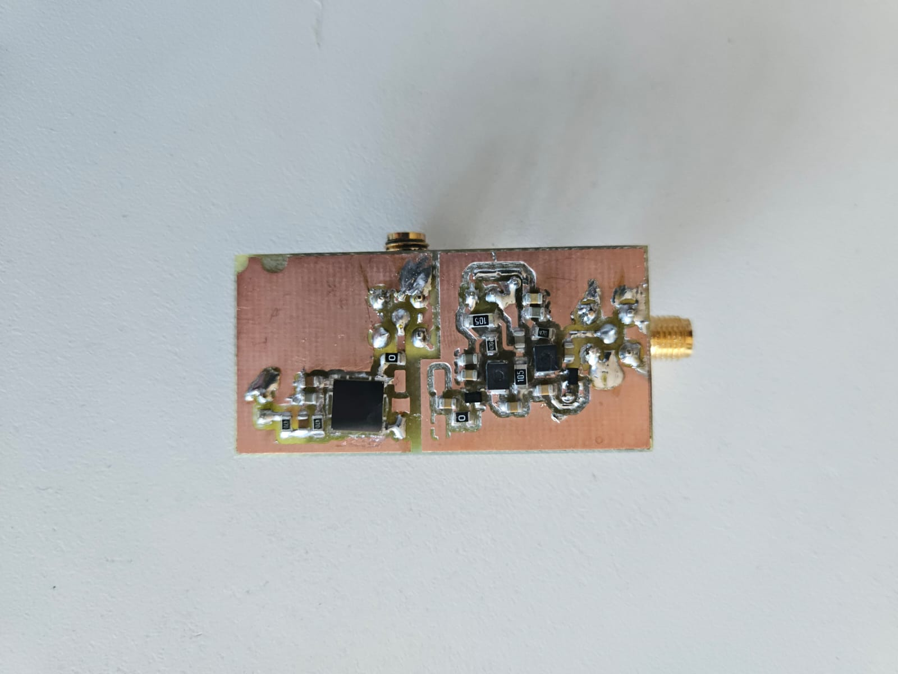
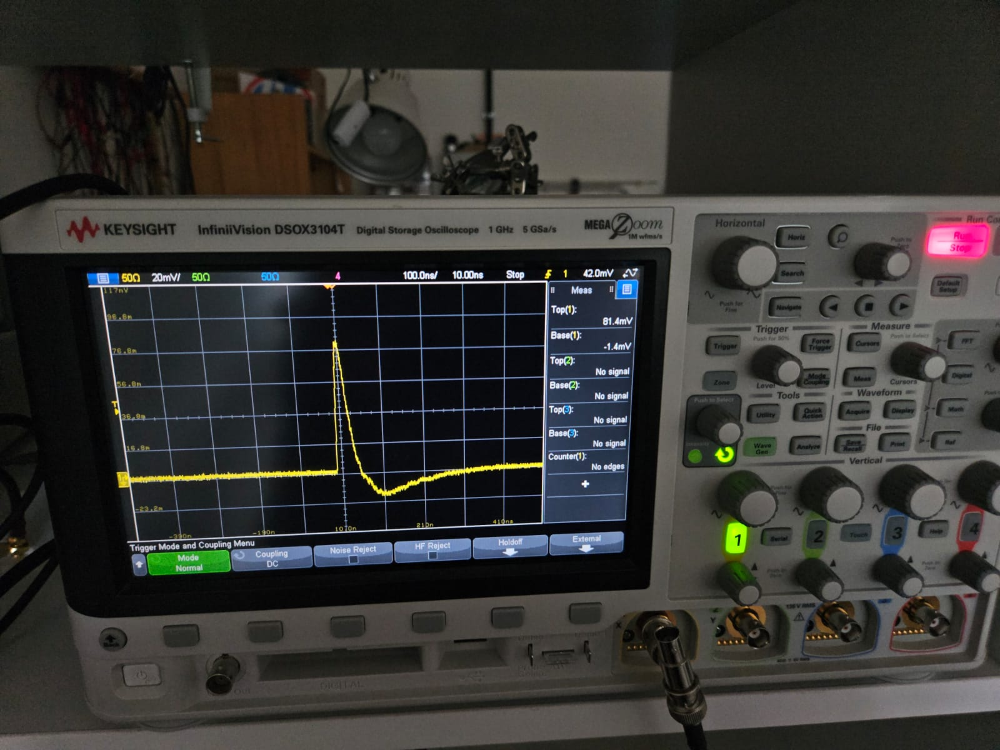
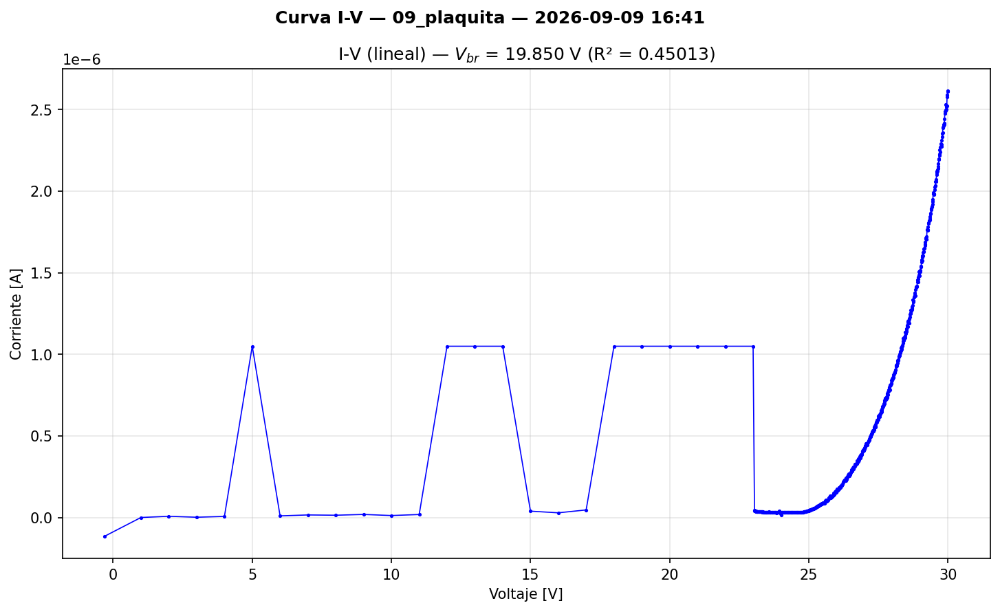
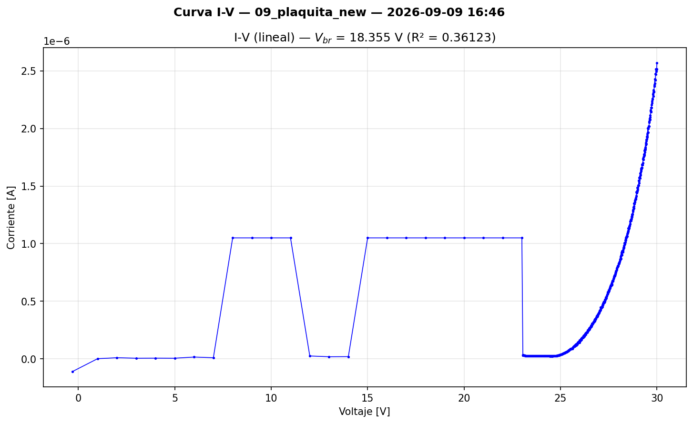
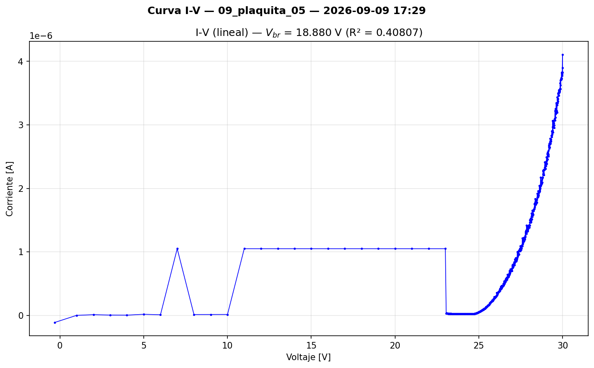
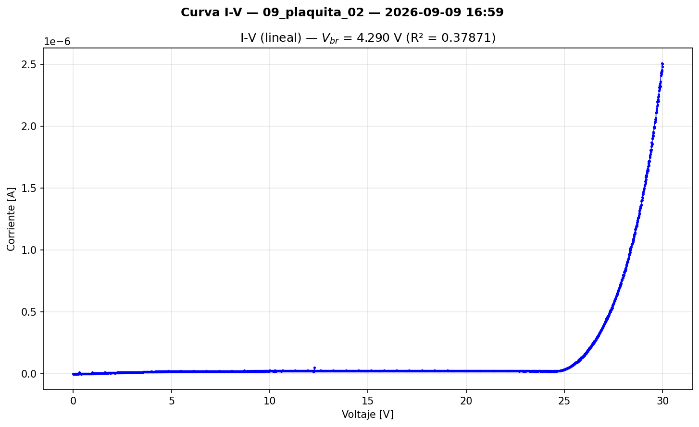
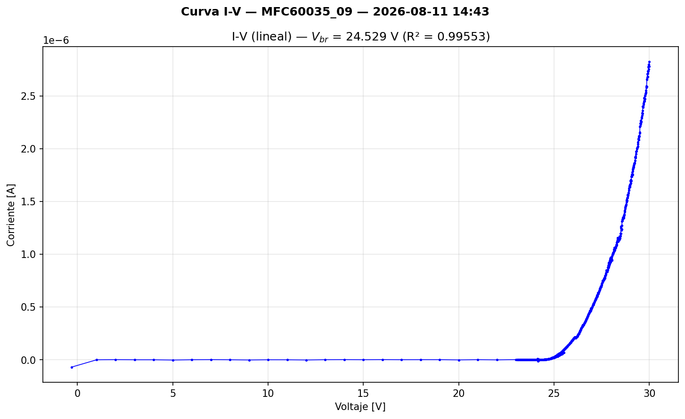

## Objetivo del día

Probar el circuito amplificador diseñado por Lara sobre la placa con SiPM #09 soldado: verificar si se observan pulsos de fotones individuales (dark counts) en el osciloscopio, y medir la curva I-V del SiPM montado en la placa amplificadora.

---

## Contexto

- En LOG 7 (31/08) se concluyó que **es imposible observar pulsos individuales del MICROFC-60035-SMT sin amplificación**, debido a la capacitancia terminal de 3400 pF que limita la señal a ~0.14 mV/PE en Standard Output y ~1–3 mV/PE en Fast Output (insuficiente para cualquier punta de osciloscopio).
- La solución identificada era un amplificador de voltaje o transimpedancia. En la tesis de referencia (Torletti, 2025), se utilizaron amplificadores **BGA614** (Infineon) en cascada, con ganancia total de ×100, con buen resultado.
- Lara Torletti (co-investigadora, autora de la tesis previa) diseñó y fabricó un **circuito amplificador dedicado** basado en esa experiencia, incorporando el SiPM directamente en la placa. Se soldó el dispositivo **MFC60035_09** (que no fue parte de los batches medidos en LOG 2 ni LOG 5, y por lo tanto no tiene una medición I-V previa como SiPM aislado).
- El SiPM #09 fue caracterizado aislado el 11/08 (Batch 2, LOG 3): **V_br = 24.529 V, R² = 0.99553**. Se dispone de la curva I-V de referencia pre-soldadura para comparación.
- El script `bias_sipm_needles.py` (Config B: voltaje positivo, cátodo a +V_bias) se usó para la polarización del SiPM.
- Se dispone de un osciloscopio **Keysight InfiniiVision DSOX3104T** (1 GHz BW, 5 GSa/s), significativamente superior al Rigol DS1204B (200 MHz) utilizado en sesiones anteriores.

---

## Descripción del circuito amplificador

### Esquemático



### Arquitectura

La placa integra el SiPM y la cadena de amplificación en un solo PCB compacto, fabricado con router CNC en la CNEA. El diseño se basa directamente en la arquitectura validada en la tesis de Torletti (sección 3.3 y 4.2), con ajustes menores.

**Bloques funcionales:**

|Bloque|Componentes principales|Función|
|---|---|---|
|SiPM|U4: MICROFC-60035-SMT-TR1|Fotodetector. Cátodo a +V_BIAS, ánodo a GND|
|Bias filter|R12 (50 Ω), R13 (50 Ω), C23 (10 nF), C24 (100 nF)|Filtro RC pasabajos en la línea de bias. Atenuación de ruido de la fuente|
|Bypass SiPM|C25 (10 nF)|Desacople local de V_BIAS junto al SiPM|
|Fast Output tap|R22, R23, C12|Acoplamiento AC de la señal del Fast Output hacia el amplificador|
|1ª etapa amplificación|Q1: BGA614, con red de bias (CB, C10, R9, R10, L1, C11, R17, R18)|Amplificador MMIC wideband (~×10). Topología emisor común (Darlington SiGe), señal invertida|
|2ª etapa amplificación|Q2: BGA614, con red de bias (C14, C16, R15, L2, C15, C17)|Segunda etapa en cascada (~×10). Doble inversión → señal neta no invertida|
|Salida amplificada|J6 ("Second Amplified Signal Output X100")|Salida SMA, ganancia total ×100|
|Alimentación|J2 (3V3 Generator)|Fuente de 3.3 V para las etapas de amplificación (independiente de V_BIAS)|

**Notas sobre el BGA614:** es un amplificador MMIC clase A con par Darlington de Silicio-Germanio, banda de DC a ~4 GHz, y bajo ruido. Cada etapa invierte la señal (emisor común). Con dos etapas en cascada, la ganancia total es ×100 y la polaridad neta se conserva. Este es el mismo amplificador usado en la tesis previa, donde demostró excelente rendimiento para pulsos de SiPM (rise time de ~1–3 ns, compatible con el ancho de banda del BGA614).

### Foto de la placa fabricada



Placa de ~5×3 cm, cobre visto (sin máscara de soldadura), con dos encapsulados negros (los BGA614), conector SMA en el borde derecho (salida amplificada J6), y conector coaxial en la parte superior (bias J8). Fabricación con router CNC en la CNEA.

---

## Trabajo realizado

### 1. Observación de pulsos de fotones individuales — HITO DEL PROYECTO

Se polarizó el SiPM #09 mediante `bias_sipm_needles.py` y se conectó la salida amplificada (J6, ×100) al osciloscopio DSOX3104T con terminación de 50 Ω.

**Configuración del osciloscopio:**

|Parámetro|Valor|
|---|---|
|Instrumento|Keysight InfiniiVision DSOX3104T (1 GHz, 5 GSa/s)|
|Canal|CH1|
|Impedancia de entrada|50 Ω|
|Escala vertical|20 mV/div|
|Base de tiempo|~10 ns/div|
|Trigger|Normal, DC coupling, ~42 mV|
|Condición de luz|Oscuridad|

**Resultado: se observaron pulsos individuales de dark counts.**



La medición automática del osciloscopio reporta:

|Parámetro|Valor|
|---|---|
|Top(1)|81.4 mV|
|Base(1)|−1.4 mV|
|Amplitud|~82.8 mV|

El pulso muestra la forma característica de un SiPM: subida rápida (~pocos ns), pico pronunciado, y caída exponencial con undershoot. La forma es consistente con la señal del Fast Output del MICROFC-60035-SMT amplificada ×100 por las dos etapas BGA614.

### 2. Variación de amplitud con V_ov

Se probaron tres valores de sobretensión:

|V_ov [V]|Amplitud del pulso (estimada)|Observación|
|---|---|---|
|2.5|~10 mV|Pulsos visibles pero pequeños|
|3.0|—|Intermedio (no registrado con precisión)|
|5.0|~40 mV|Pulsos claramente visibles, buena SNR|

**Nota sobre la captura:** el pulso fotografiado (Top = 81.4 mV) fue seleccionado intencionalmente por ser un evento grande y visualmente claro. La amplitud **media** de los pulsos a V_ov = 5 V es ~40 mV. El evento de ~80 mV es probablemente un evento multi-PE (2 fotoelectrones simultáneos por crosstalk óptico o afterpulsing, frecuente a V_ov altos). Para futuras sesiones se recomienda capturar screenshots para cada V_ov con la medición automática activa, y usar el modo de persistencia o histograma del DSOX3104T para obtener distribuciones de amplitud.

**Consistencia con el modelo:** la ganancia del SiPM escala linealmente con V_ov. A V_ov = 2.5 V, Gain ≈ 3×10⁶ (datasheet). A V_ov = 5.0 V, Gain ≈ 6×10⁶. Se espera que la amplitud del pulso sea ~2× mayor a V_ov = 5 V que a V_ov = 2.5 V. La relación observada (40 mV / 10 mV = 4×) sugiere que la amplitud escala más que linealmente, posiblemente por el aumento de la probabilidad de crosstalk óptico a V_ov alto (cada PE primario puede disparar PEs adicionales en microceldas vecinas, incrementando la carga total por evento).

### 3. Prueba de luz vs oscuridad

|Condición|Resultado|
|---|---|
|**Oscuridad**|Pulsos individuales visibles, tasa consistente con dark count rate|
|**Luz ambiente**|No se observan pulsos individuales. I_dark medida: ~16000 nA, compliance alcanzado|

**Interpretación:** con luz ambiente, la tasa de fotodetecciones es tan alta que los pulsos individuales se superponen y forman una corriente continua (saturación). La corriente de 16 µA confirma que el SiPM responde a fotones. En oscuridad, la tasa de dark counts (~1200–3400 kHz según datasheet a V_ov = 2.5 V) es suficientemente baja para resolver pulsos individuales en el osciloscopio con trigger normal.

Esta observación es consistente con el test de luz vs oscuridad de LOG 2 (10/08), donde se mostró que la fotocorriente desplaza la curva I-V. Ahora se confirma el mismo efecto a nivel de pulsos individuales.

### 4. Curvas I-V del SiPM en la placa amplificadora — artefactos y resolución

Se midió la curva I-V del SiPM #09 montado en la placa amplificadora usando `iv_curve_sipm_complete.py` (v2.0, barrido en 3 fases). Se observó un artefacto consistente en la zona de corriente de fuga.

#### 4.1 Artefacto: saltos de corriente en la zona pre-breakdown

Las primeras tres mediciones (con el script de 3 fases: paso grueso de 1 V en 1–23 V, paso fino de 10 mV en 23–30 V) mostraron saltos abruptos de corriente en la región de fuga:

|Medición|Archivo|Voltajes con saltos|Corriente del plateau|
|---|---|---|---|
|1ª|`IV_09_plaquita`|~5, ~12–14, ~18–22 V|~1.05 µA|
|2ª|`IV_09_plaquita_new`|~8–11, ~16–22 V|~1.05 µA|
|3ª|`IV_09_plaquita_05`|~7, ~11–23 V|~1.05 µA|

  

**Características de los saltos:**

- Aparecen solo en la zona de fuga (0–23 V), donde el paso es grueso (1 V/punto).
- No aparecen en la zona post-breakdown (23–30 V), donde el paso es fino (10 mV/punto).
- Las posiciones de los saltos **varían entre mediciones** (no son reproducibles en voltaje).
- Los plateaus alcanzan siempre ~1.05 µA (muy por debajo del compliance de 100 µA).
- La extracción automática de V_br falla en todos los casos (R² ~ 0.36–0.45, V_br reportado ~ 18–20 V vs 24.5 V esperado).

#### 4.2 Hipótesis y test: efecto del tamaño de paso

Se hipotetizó que los saltos eran artefactos causados por el paso grande de tensión (1 V) interactuando con las capacitancias parásitas de la placa amplificadora. La placa tiene ~120 nF de capacitancia en la línea de bias (C23 = 10 nF, C24 = 100 nF, C25 = 10 nF) más las capacitancias de entrada de los BGA614 y los acoplamientos parásitos entre pistas.

Cuando el SMU aplica un escalón de ΔV = 1 V, la corriente transitoria para cargar las capacitancias es:

```
I_peak = ΔV / R_serie = 1 V / 100 Ω = 10 mA  (limitado por compliance o por el autoranging)
```

Aunque el settling time (50 ms) es >>5τ (τ = 100 Ω × 120 nF = 12 µs), los saltos podrían deberse a interacciones entre el autoranging del Keithley y los transitorios de corriente. El SMU cambia de rango de medición durante el transitorio, y si la medición se toma antes de que el autoranging se estabilice, el valor reportado es incorrecto. Esto explicaría:

- La posición no reproducible (depende del timing exacto del autoranging).
- El plateau a ~1 µA (podría corresponder a un rango de medición específico del Keithley).
- La desaparición con paso fino (ΔV = 10 mV produce transitorios 100× menores, sin cambio de rango).

**Test:** se modificó el script para usar paso uniforme de 10 mV en todo el rango (0–30 V, 3001 puntos) → `iv_curve_sipm_complete2.py`.

#### 4.3 Resultado con barrido uniforme fino



**Los saltos grandes desaparecieron completamente.** La curva muestra:

- **0–24 V:** corriente de fuga plana/ligeramente creciente, del orden de decenas de nA. Perfil limpio sin saltos abruptos.
- **~24–25 V:** inicio del breakdown. Rodilla visible.
- **25–30 V:** corriente creciente post-breakdown, hasta ~2.5 µA a 30 V.

La forma general es consistente con un SiPM funcional y con las curvas obtenidas para los dispositivos del batch 1 (LOG 2), confirmando que el SiPM #09 no fue dañado durante la soldadura.

**Observación adicional:** en la zona de corriente de fuga (0–24 V) se detectaron **pequeños spikes periódicos**, del orden de decenas de nA, que no se aprecian en el gráfico porque la escala está dominada por la rampa post-breakdown. La periodicidad sugiere un efecto sistemático, posiblemente relacionado con:

- Cambios de rango del autorange del Keithley (cada vez que la corriente cruza un umbral de rango, hay una perturbación transitoria).
- Ciclos de la fuente switching interna del Keithley (~1.18 MHz, identificada en LOG 7).
- Efectos de los amplificadores BGA614 (que están alimentados y activos durante la medición I-V, aunque no deberían afectar la corriente de bias).

**No se determinó la causa definitiva en esta sesión.** Los spikes son del orden de los nA y no afectan la medición post-breakdown ni la extracción de V_br. Se documentan para trazabilidad.

#### 4.4 Extracción automática de V_br — resultados inválidos, análisis pendiente

El algoritmo de extracción de V_br (ajuste lineal de √I vs V) produjo resultados inconsistentes en todas las mediciones de esta sesión:

|Medición|V_br reportado|R²|Comentario|
|---|---|---|---|
|09_plaquita (3 fases)|19.850 V|0.450|Contaminado por artefactos de paso grueso|
|09_plaquita_new (3 fases)|18.355 V|0.361|Idem|
|09_plaquita_05 (3 fases)|18.880 V|0.408|Idem|
|09_plaquita_02 (uniforme)|4.290 V|0.379|Curva limpia pero extracción errónea|

Para referencia, la medición del SiPM #09 aislado (Batch 2, 11/08, LOG 3) dio **V_br = 24.529 V con R² = 0.99553**.

Los valores de R² << 0.99 y los V_br alejados de 24.5 V indican que el algoritmo no está ajustando correctamente en este contexto. La causa probable es que el umbral de detección de la zona post-breakdown (SQRT_I_THRESHOLD = 10⁻⁴ √A ≈ 10 nA) se dispara prematuramente por la corriente de fuga del PCB (~10–30 nA), haciendo que el ajuste lineal intente cubrir un rango excesivamente amplio que no es lineal en √I vs V.

**Preguntas abiertas:**

1. **¿Cambió V_br al soldar el SiPM en la placa amplificadora?** Para responder esto se necesita una extracción confiable de V_br a partir de los datos del barrido uniforme (09_plaquita_02), que visualmente muestra breakdown a ~24.5 V pero no tiene un V_br extraído correctamente.
2. **¿Los spikes periódicos en la zona de fuga del barrido uniforme son artefactos del SMU o de la placa?** Correr el script de barrido uniforme sobre un SiPM no soldado permitiría aislar la causa.

**Mejoras pendientes para el script de extracción:**

- Adaptar el algoritmo para que funcione tanto con SiPM aislado como montado en PCB (ej. subir umbral, restringir rango de ajuste, o detectar rodilla por derivada).
- Generar una herramienta de análisis unificada que permita comparar V_br entre mediciones de SiPM solo y SiPM en placa, con criterios de calidad consistentes.
- Alertar al operador cuando R² < 0.99 (indicador de extracción no confiable).

---

## Significado del resultado

**Esta sesión marca la primera observación directa de pulsos de fotones individuales en el proyecto Gamma Tracker.** Los resultados validan simultáneamente:

1. **El SiPM #09 es funcional** después de la soldadura (a diferencia del #05, destruido en LOG 6).
2. **El amplificador BGA614 ×100 funciona** según lo diseñado, con ganancia suficiente para resolver pulsos individuales.
3. **La cadena SiPM → Fast Output → amplificador → osciloscopio está operativa.** Esto desbloquea todas las mediciones de pulsos pendientes desde LOG 7.
4. **La amplitud de los pulsos escala con V_ov**, confirmando operación en modo Geiger con ganancia variable.
5. **La placa amplificadora es un candidato viable para la sonda** del Gamma Tracker, pendiente de optimización y fabricación profesional.

Esto resuelve el bloqueo principal del proyecto desde LOG 6 (25/08): la imposibilidad de observar señales del SiPM sin amplificación.

---

## Lecciones aprendidas

### 1. El barrido I-V con pasos gruesos produce artefactos en PCBs con capacitancias

Las capacitancias de la placa amplificadora (~120 nF en la línea de bias) generan transitorios de corriente durante los escalones de voltaje. Con pasos grandes (1 V), estos transitorios interactúan con el autoranging del Keithley y producen lecturas espurias de ~1 µA. Con pasos finos (10 mV), los transitorios son 100× menores y no causan problemas. **Para mediciones I-V de SiPM montados en PCB, usar siempre barrido uniforme fino.**

### 2. El algoritmo de extracción de V_br necesita adaptarse al contexto de medición

El umbral de √I que funcionaba para SiPM aislados produce valores erróneos cuando el SiPM está montado en PCB, donde la corriente de fuga del substrato supera el umbral. Es necesario desarrollar un método de extracción que funcione en ambos contextos de forma consistente, permitiendo comparar V_br entre las dos condiciones de medición.

### 3. Documentar las condiciones de medición del osciloscopio es esencial

Para futuras sesiones con pulsos, capturar un screenshot del osciloscopio para cada condición de V_ov, con la medición automática de Top/Base activa. Esto permite análisis cuantitativo posterior (extracción de ganancia, comparación entre dispositivos, etc.).

---

## Scripts utilizados / generados

|Script|Función|Estado|
|---|---|---|
|`bias_sipm_needles.py`|Bias DC Config B (voltaje positivo) para polarizar el SiPM en la placa amplificadora|Existente (LOG 7), reutilizado sin cambios|
|`iv_curve_sipm_complete.py`|Curva I-V, 3 fases (grueso + fino)|Existente (v2.0) — produjo artefactos en la zona de fuga|
|`iv_curve_sipm_complete2.py`|Curva I-V, barrido uniforme fino (0–30 V, paso 10 mV, 3001 pts)|**Nuevo** — resolvió los artefactos|

---

## Archivos generados

- `IV_09_plaquita_20260909_164121.csv` / `.png` — Curva I-V, 3 fases, 1ª medición (con artefactos)
- `IV_09_plaquita_new_20260909_164554.csv` / `.png` — Curva I-V, 3 fases, 2ª medición (con artefactos)
- `IV_09_plaquita_05_20260909_172935.csv` / `.png` — Curva I-V, 3 fases, 3ª medición (con artefactos)
- `IV_09_plaquita_02_20260909_165900.csv` / `.png` — Curva I-V, barrido uniforme fino (limpia)
- Captura del osciloscopio — pulso de dark count amplificado ×100

**Referencia pre-soldadura (del 2026-08-11, LOG 3):**

- `IV_MFC60035_09_20260811_144303.csv` / `.png` — Curva I-V del SiPM #09 aislado, V_br = 24.529 V, R² = 0.99553



---

## Pendientes del LOG anterior (14/09) — estado

- [x] **Conseguir amplificador para readout del 60035** → **RESUELTO**: placa amplificadora BGA614 ×100 diseñada y fabricada por Lara. Pulsos observados.


---

## Pendientes

- [ ] **Mandar a fabricar la placa amplificadora profesionalmente** (siguiente paso inmediato). Evaluar fabricantes (JLCPCB, PCBWay, etc.) y definir si incluir assembly o solo PCB.
- [ ] **Evaluar otros circuitos de adquisición y preamplificación** como alternativas al BGA614 ×100 (ej. TIA con op-amp de alta velocidad, amplificador discreto con menor ruido, etc.) para comparar rendimiento.
- [ ] **Desarrollar extracción de V_br unificada** que funcione tanto para SiPM aislado como montado en PCB, y permita comparar resultados entre ambas condiciones. Evaluar si V_br del #09 cambió tras la soldadura (referencia: 24.529 V aislado, LOG 3).
- [ ] **Correr barrido uniforme fino sobre un SiPM no soldado** (con agujas) para determinar si los spikes periódicos en la zona de fuga son artefactos del SMU o de la placa amplificadora.
- [ ] Repetir mediciones de pulsos con captura sistemática de screenshots por V_ov (2.5, 3.0, 5.0 V) para cuantificar ganancia.
- [ ] Medir espectro de amplitud de pulsos (histograma de alturas) para verificar resolución de 1-PE, 2-PE, etc.
- [ ] Completar el setup térmico (Arduino + Peltier + control PID) para Tarea 3.
- [ ] Adaptar `bias_sipm_needles.py` con el V_br medido del SiPM #09 (24.529 V según LOG 3, pendiente de verificación post-soldadura).

---

## Próximos pasos

1. **Fabricación profesional de la placa amplificadora:** enviar el diseño de Lara a un fabricante de PCB. Esto permitirá tener múltiples unidades con calidad consistente para la matriz multipíxel.
2. **Exploración de alternativas de front-end:** diseñar y probar al menos un circuito alternativo de preamplificación para comparar con el BGA614 ×100 (por ejemplo, un diseño basado en TIA o en amplificador de tensión con diferente topología).
3. **Caracterización cuantitativa de los pulsos:** con el sistema amplificador validado, medir sistemáticamente la respuesta del SiPM: espectro de single-PE, ganancia vs V_ov, resolución temporal, dark count rate, crosstalk óptico.

---

## Referencias

- **Torletti, L.** (2025). _Gamma Tracker: Instrumentación para la detección de radiación gamma en cirugía laparoscópica._ Tesis de grado. Secciones 3.3 y 4.2 — diseño del amplificador BGA614.
- **BGA614 datasheet** (Infineon) — MMIC wideband amplifier, DC–4 GHz, NF ~2 dB, Gain ~17 dB por etapa.
- **AND9782/D** (onsemi) — Biasing and Readout of ON Semiconductor SiPM Sensors.
- **DataSheet MICROC-SERIES/D** (onsemi, Rev. 9) — Parámetros del MICROFC-60035-SMT.

---

_Log generado el 15 de septiembre de 2026, reconstruido a partir de notas y capturas de la sesión del 9 de septiembre._
