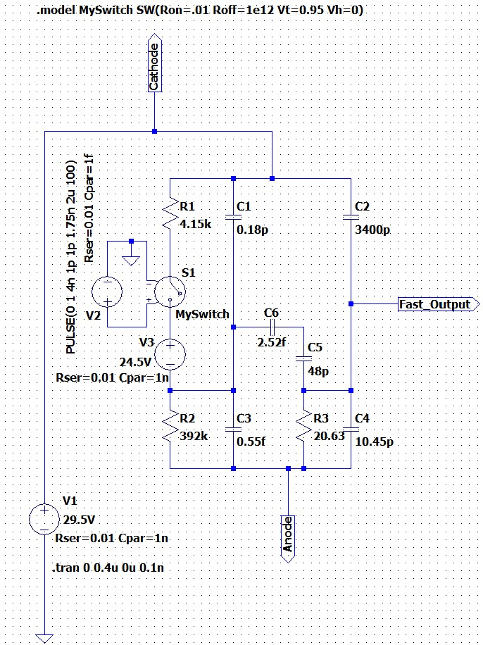
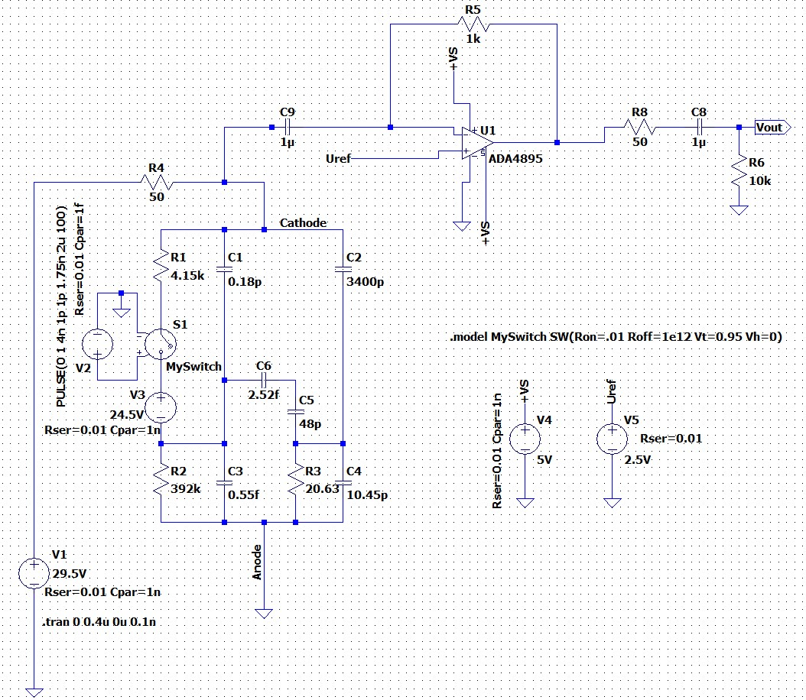
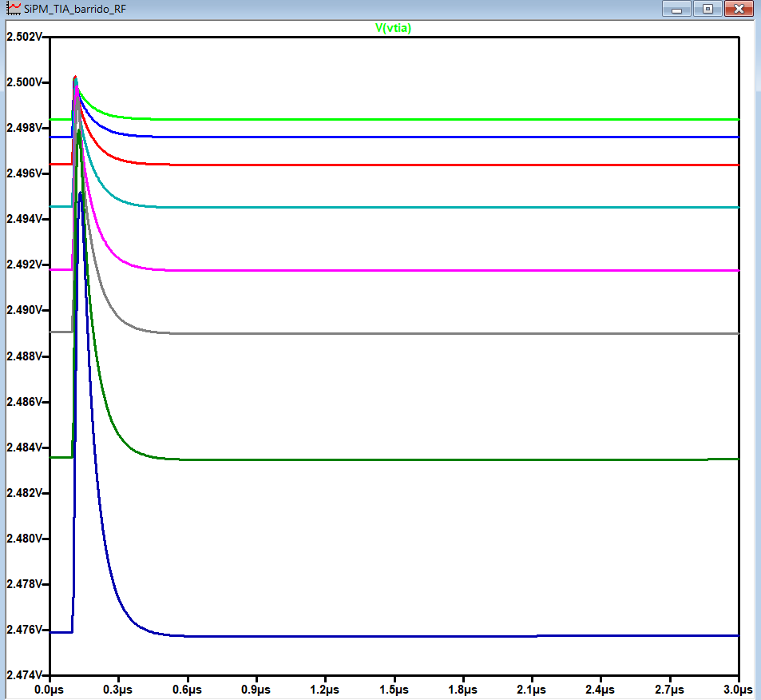
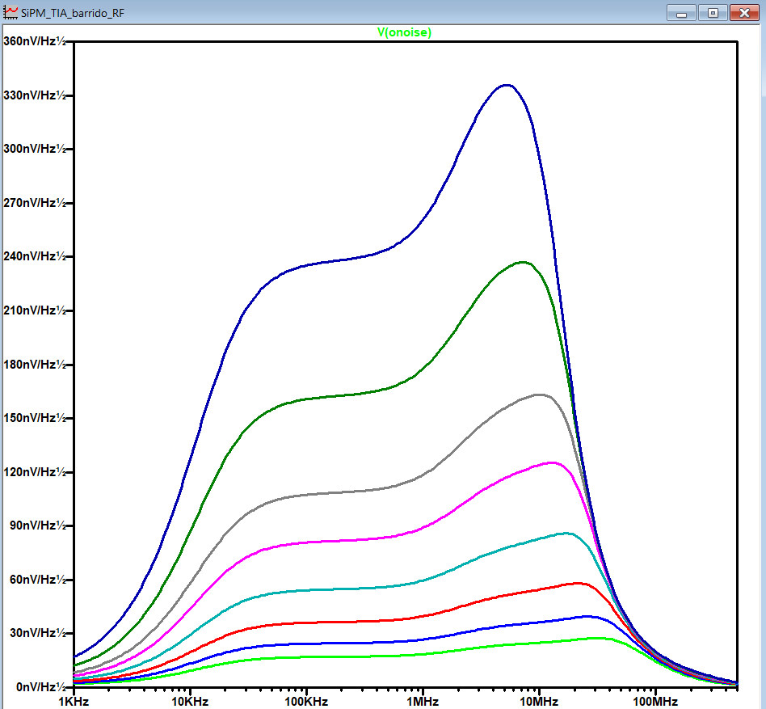
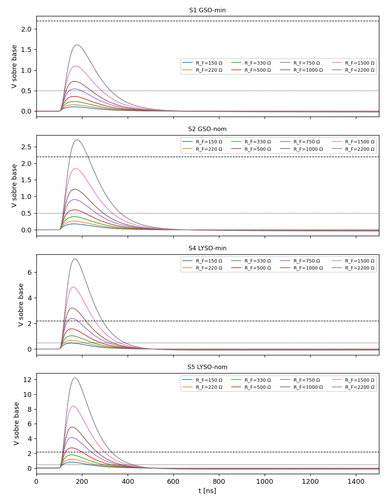
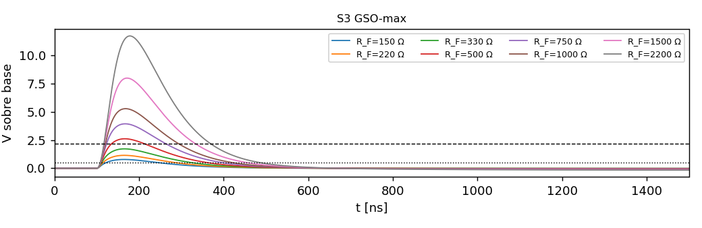
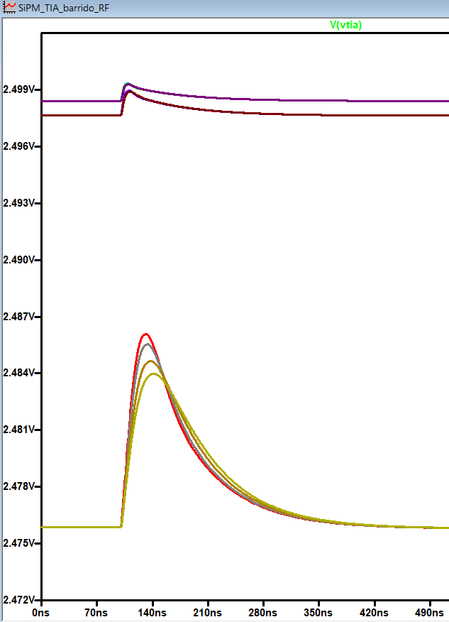

## Sesión de diseño y simulación: TIA de una etapa en Configuración C y estudio del rango de ganancia para la placa de evaluación

**Tipo:** diseño y simulación (LTspice + Python). Sin trabajo experimental.

---

## Objetivo

Conectar el modelo SPICE del SiPM (Chernov) en la Configuración C de la AND9782/D con una sola etapa TIA (ADA4895), y definir el rango de ganancia (R_F) de una placa de evaluación capaz de cubrir tanto LYSO como GSO.

---

## Resumen

- La Configuración C con TIA de una etapa funciona en simulación: pulso positivo, estable, sin ringing.
- Circuito: **C_c = 1 µF** (acople cátodo → −IN), **R4 = 10 Ω**, **sin C_F**, Uref = 2.5 V, 5 V single supply.
- Muchas variables afectan la altura del pulso (cristal LYSO/GSO, colección de luz, V_ov, ganancia real del SiPM). Por eso se decidió una **placa de evaluación con R_F variable** (resistencias en paralelo habilitadas con jumpers).
- Un estudio de simulación definió el banco: **base 2.2 kΩ + ramas 3.0 kΩ / 750 Ω / 240 Ω** → 8 configuraciones entre 2.2 kΩ y 159 Ω.

---

## 1. Configuración C

Usar la **Configuración C** de la AND9782/D, sin tensiones negativas. +V_bias → R_S → cátodo, ánodo a 0 V, lectura por cátodo. El SiPM entrega un pulso negativo y el TIA lo invierte → **pulso positivo a la salida con una sola etapa**.

---

## 2. Modelo del SiPM en LTSpice




---

## 3. Conexión al TIA

- **Intento 1:** cátodo conectado en DC al −IN. No funcionó: el −IN quedaba a ~29 V, fuera del rango del opamp, y la salida se saturaba.
- **Intento 2:** capacitor de acople **C_c = 1 µF** entre cátodo y −IN (en la placa: ≥ 50 V). Funciona: pulso positivo, sin ringing.
- **Ajuste final:** **R4 = 10 - 50 Ω** y **sin C_F**. Motivos:
    - el ADA4895 exige ganancia de ruido > 10; con R4 = 10 Ω se cumple incluso con R_F bajas;
    - la impedancia que ve el SiPM es baja, así que no se estira el pulso (la AND9782 sugiere 10 Ω para 6 mm).




**Sobre la recomendación del datasheet del ADA de R_F ≤ 1 kΩ:** está en la sección de ruido y es para configuraciones de ganancia de tensión, no un límite de estabilidad. Ver cuanto afecta al ruido. De todas formas, Chernov usa 3.3k y ellos validaron experimentalmente este op-amp.

---

## 4. Por qué una placa con ganancia variable

La altura del pulso por gamma de 511 keV depende de:

- **el cristal** (LYSO ~32 000 fot/MeV, decaimiento 40 ns; GSO ~9 000 fot/MeV, decaimiento 56 ns + 400 ns, Knoll T. 8.3). **Se consideran ambos**
- **la colección de luz (LCE)**, que no está medida (estimada entre 25 y 50 %) y depende del acople optico, reflexiones y refracciones;
- **V_ov** (carga por celda y PDE);
- **la carga real por celda** (ver §6.3).

Con tanta incertidumbre no se puede fijar una ganancia sin riesgo de saturar o de quedar corto. Proceso de decisión:

1. Lipo sugirió soldar distintas resistencias → idea de una **placa de evaluación (EVB-TIA v0)**.
2. Fabri sugirio **resistencias en paralelo**, de fábrica la más grande, y agregar las otras **con jumpers** para bajar la ganancia.
3. Estudio en simulación para definir los valores (§5 y §6).

---

## 5. Método del estudio

**Criterios:**

| #   | Criterio                                              | Umbral                        |
| --- | ----------------------------------------------------- | ----------------------------- |
| C1  | El fotopico de 511 keV no satura                      | V_pk ≤ 2.2 V sobre la base    |
| C2  | Fotopico medible                                      | V_pk ≥ 0.5 V                  |
| C3  | El fotoelectrón individual (SPE) se ve sobre el ruido | SNR ≥ 5                       |
| C4  | Estable                                               | Sin ringing, undershoot < 5 % |

Me queda definir cual es el valor de energia mas grande que nos interesa medir. Por ej. varios fotopicos del gamma de 511keV para ver pile up?

**Escenarios** (de menos a más luz):

|Escenario|Cristal|LCE|V_ov|
|---|---|---|---|
|S1|GSO (LY mín.)|25 %|2.5 V|
|S2|GSO (LY nom.)|37.5 %|2.5 V|
|S3|GSO (LY máx.)|50 %|5 V|
|S4|LYSO (LY mín.)|25 %|2.5 V|
|S5|LYSO (LY nom.)|37.5 %|2.5 V|

Excluido: LYSO con LCE 50 % a 5 V, porque necesitaría R_F ≈ 65 Ω, en el límite de estabilidad. En ese caso se baja V_ov.

**Supuestos:** crosstalk a 5 V = 20 % (el datasheet solo da 7 % a 2.5 V); PDE del GSO a 440 nm = 0.95 × PDE a 420 nm.

**Escalado a 511 keV fuera de LTspice.** Siempre se simula con el modelo del SiPM, que da la respuesta a **un fotón**. El pulso de un gamma se obtiene en Python:

V_gamma(t) = N_avalanchas × [ respuesta a un fotón ⊛ decaimiento del cristal ]

Uso un algoritmo de convolucion porque la luz llega repartida en el tiempo: multiplicar solo el pico sobreestima el pulso 2–3 veces. Script: `escalado_spe_gamma.py`. Todos los parámetros y supuestos están al comienzo del archivo.

```
python escalado_spe_gamma.py spe_vov2p5.txt --vov 2.5 --noise ruido_vov2p5.csv --out esc_vov2p5
```

Opciones: `--q_scale` reescala la carga del SPE (§6.3). 

---

## 6. Simulaciones y resultados

### 6.1 Setup en LTspice

Cambios sobre el esquemático final: R5 = `{RF}`; C7 = `{CPAR}` (parásitos de las ramas); V1 = `{VB}`; salida del opamp etiquetada `vtia`; V2 = `PULSE(0 1 100n 1p 1p 1.75n 10u 1)` (un solo disparo a 100 ns; el original repetía a 2 µs).

**Corrida A — respuesta a un fotón** (VB = 27 → V_ov 2.5 V; VB = 29.5 → V_ov 5 V; exportar `V(vtia)`):

```
.param RF=1k CPAR=1p VB=27
.step param RF list 150 220 330 500 750 1k 1.5k 2.2k
.tran 0 3u 0 0.1n
.options plotwinsize=0
.meas tran Vbase AVG V(vtia) FROM 50n TO 95n
.meas tran Vtop  MAX V(vtia)
.meas tran SPEpk PARAM Vtop-Vbase
.meas tran Vmin  MIN V(vtia) FROM 100n TO 3u
.meas tran Und   PARAM (Vbase-Vmin)/SPEpk
```

**Corrida B — ruido:**

```
.param RF=1k CPAR=1p VB=27
.step param RF list 150 220 330 500 750 1k 1.5k 2.2k
.noise V(vtia) V1 dec 50 1k 500Meg
.meas NOISE Vn INTEG V(onoise) FROM 1k TO 500Meg
```

**Corrida C — parásitos de jumpers:** la corrida A con `.step param RF list 150 220 2.2k` y `.step param CPAR list 0 1p 3p 5p`.

**Corrida D — calibración:** las corridas A y B con `.step param RF list 2.2k 3.3k 4.7k 6.8k`.

### 6.2 Respuesta a un fotón

Pulso positivo único, estable, que vuelve a la base en < 0.5 µs. La línea de base baja con R_F por la corriente de bias del ADA4895 (~24 mV con 2.2 kΩ); es esperable y el script la resta.




### 6.3 Carga por celda: modelo vs datasheet

El modelo entrega **~65 % de la carga por celda** que indica el datasheet (0.31 vs 0.48 pC a 2.5 V), independientemente de R_F. Todo el estudio se hizo con las dos hipótesis (`--q_scale 1.53`). **Pendiente medirlo en la placa.**

> [!WARNING] 
> > **ME EQUIVOQUE CON LA CUENTA, NO DA 65% DE LA CARGA, DA 90% Y ESTAMOS USANDO UNA FUENTE CON 1.75ns DE TAO, NO LE DA TIEMPO A DESCARGAR => --q_scale 1.2, no 1.53 en el script**


### 6.4 Ruido

El ruido no depende de V_ov (idéntico a 27 V y 29.5 V). Crece con R_F: ~0.26 mV rms con 150 Ω, ~1.33 mV con 2.2 kΩ. Lo domina e_n × ganancia de ruido, con un pico entre 1 y 20 MHz por los 3400 pF del SiPM.




### 6.5 Pulso a 511 keV por escenario






Ventana de R_F que cumple C1–C4 (tablas completas en los CSV):

|Escenario|Carga del modelo|Carga del datasheet|
|---|---|---|
|S1 GSO|750 Ω – 2.2 kΩ|500 Ω – 1.5 kΩ|
|S2 GSO|750 Ω – 1.5 kΩ|330 Ω – 1 kΩ|
|S3 GSO 5 V|150 – 330 Ω|150 – 220 Ω|
|S4 LYSO|~500 Ω|150 – 330 Ω|
|S5 LYSO|— (ver nota)|150 – 220 Ω|
> [!IMPORTANT] 
> > Es el rango de resistencias que cumple los cuatro criterios (no satura, el pulso es medible, se ve el SPE, es estable) para cada escenario

### 6.6 Parásitos de los jumpers

Estable en todos los casos hasta 5 pF, sin oscilación. Con R_F alta, el parásito recorta el pico del SPE (−14 % con 3 pF y 2.2 kΩ) sin cambiar su carga. Era esperable, puse capacitancias de hasta 20pF y no hubo problemas, pero lo agrego a la simulacion por completitud.




### 6.7 Calibración con dark counts

La SNR del SPE (a V_ov = 2.5 V) casi no mejora al subir R_F: 7.2 con 2.2 kΩ y 8.8 con 6.8 kΩ, porque señal y ruido crecen juntos. **Se acepta SNR ≈ 7 con 2.2 kΩ** (a 5 V sería ~14).

**Cálculo de la SNR del SPE**
SNR = SPE_pk / v_n,rms, calculada para cada R_F:

- **SPE_pk:** amplitud del pulso de un fotón en la salida del TIA (`vtia`). Sale del transitorio (corrida A) como el máximo de V(vtia) menos la línea de base, promediada entre 50 y 95 ns: `.meas SPEpk`.
- **v_n,rms:** ruido rms total en `vtia`. Sale de la corrida de ruido (`.noise`) integrando V(onoise) entre 1 kHz y 500 MHz: `.meas NOISE Vn INTEG`.

El ruido no depende de V_ov, así que el mismo v_n,rms vale para 2.5 y 5 V. Es una estimación conservadora: integra el ruido en toda la banda, sin filtro de conformación, y compara el pico de la señal con el valor rms del ruido.

---

# 7. Opciones de banco de R_F

Criterio: cubrir el rango ~150 Ω – 2.2 kΩ con 3 jumpers. Con todos los jumpers abiertos (estado de fábrica) queda la R_F máxima, que es la configuración de calibración con dark counts. Cada jumper que se cierra baja la ganancia. Valores E24, 0603 al 1 %.

#### Opción A — Banco actual (paralelo)

Base 2.2 kΩ ∥ J1 = 3.0 kΩ, J2 = 750 Ω, J3 = 240 Ω. Salto máximo: **2.27×**.

| J1 | J2 | J3 | R_F |
|---|---|---|---|
| – | – | – | 2200 Ω |
| ✓ | – | – | 1269 Ω |
| – | ✓ | – | 559 Ω |
| ✓ | ✓ | – | 471 Ω |
| – | – | ✓ | 216 Ω |
| ✓ | – | ✓ | 202 Ω |
| – | ✓ | ✓ | 168 Ω |
| ✓ | ✓ | ✓ | 159 Ω |


---

## 8. Observaciones sobre documentos previos

- `Mem_calc_saturacion.md` y `Mem_calc_pile_up.md`: basadas en LYSO y en la doble etapa. Actualizar con el circuito de una etapa, con GSO y con el pulso convolucionado (la aproximación triangular sobreestima el pico).

---

## Pendientes

- [ ] Diseñar la EVB-TIA v0 en KiCad (banco de R_F, footprint de C_F y de filtro de salida sin montar).
- [ ] Definir el tipo de jumper y mantener el parásito ≤ ~3 pF.
- [ ] Decidir SiPM soldado o con conector (si hay conector, simular su inductancia).
- [ ] Incluir el filtro de bias (AND9782 Fig. 10) en la simulación.
- [ ] Verificar el stock del ADA4895-1 en LCSC.
- [ ] En la placa: medir la carga del SPE y el cociente fotopico/SPE → LCE real.
- [ ] Actualizar las memorias de saturación y pile-up.

---

## Archivos

- Proyecto: `escalado_spe_gamma.py`.
- Locales (`...\LTSpice\TIA-ADA4895\barrido evaluation board\`): `SiPM_TIA_barrido_RF.asc`, `spe_vov2p5.txt`, `spe_vov5p0.txt`, `ruido_vov2p5.csv`, `ruido_vov5p0.csv`, `esc_*.csv/.png`.

## Referencias

- onsemi, AND9782/D, Rev. 3 (Fig. 6, 10, 14).
- Analog Devices, ADA4895-1/-2 Data Sheet, Rev. B (pp. 18 y 21).
- onsemi, MICROC-SERIES/D (Tabla 1, Fig. 3).
- Knoll, _Radiation Detection and Measurement_, Tabla 8.3.
- Torletti Daniluk (2025), §2.4.
- Chernov (2026), comunicación personal: modelo SPICE del SiPM.
