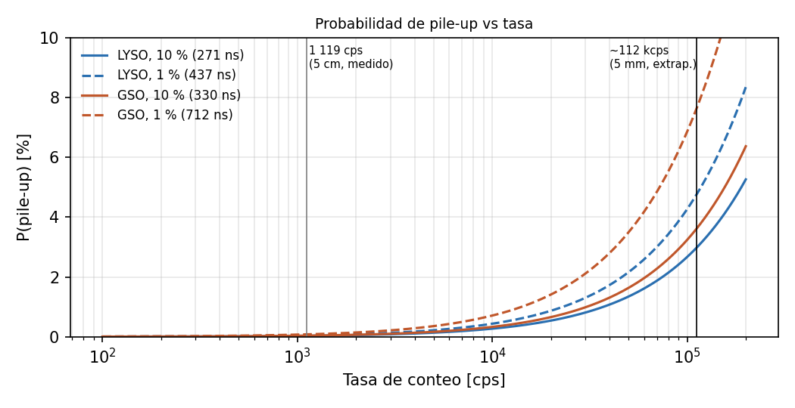

# Memoria de Cálculo: Probabilidad de apilamiento (pile-up)

*Revisión 2 — 23/09/2026. Reemplaza la versión basada en un ancho de 300 ns del circuito de doble etapa y solo LYSO. Contexto: LOG 9 y `Mem_calc_saturacion.md`.*

## 1. Objetivo

Estimar la probabilidad de pile-up en el peor escenario clínico (contacto con tejido marcado con ¹⁸F-FDG), para **LYSO y GSO**, con el TIA de una etapa en Configuración C.

## 2. Tasa de conteo

- **Medida:** 1 119 cps a 5 cm de una fuente de ¹⁸F (11 192 cuentas en 10 s, umbral 500 mV).
- **Extrapolada a 5 mm** con 1/r² (factor 100): **R_max ≈ 112 kcps**.

Esta extrapolación es una **cota superior**. A 5 mm la distancia es comparable al tamaño del cristal, así que el ángulo sólido ya no escala como 1/r² y la tasa real será menor. Se usa el mismo valor para los dos cristales: tienen densidades parecidas (7.1 y 6.7 g/cm³).

## 3. Ancho del pulso

Sale de la forma del pulso (convolución del centellador con la recuperación de la celda, τ_r ≈ 71 ns; ver la memoria de saturación). El ancho lo fijan el cristal y el SiPM, no el TIA.

| Cristal | Hasta 10 % del pico | Hasta 1 % del pico |
|---|---|---|
| LYSO | 271 ns | 437 ns |
| GSO | 330 ns | 712 ns (lo alarga la componente de 400 ns) |

La versión anterior usaba 300 ns para todos los casos.

## 4. Modelo

Llegadas de Poisson. Hay pile-up si llega otro gamma dentro del ancho τ:

  P_pile-up = 1 − e^(−R·τ)

## 5. Resultados (R = 112 kcps)

| Cristal | τ (10 %) | P | τ (1 %) | P |
|---|---|---|---|---|
| LYSO | 271 ns | 3.0 % | 437 ns | 4.8 % |
| GSO | 330 ns | 3.6 % | 712 ns | 7.6 % |

- A 5 cm (1 119 cps), la probabilidad es < 0.1 % en todos los casos.
- El criterio del 10 % mide si un segundo pulso se distingue. El del 1 % indica cuándo la línea de base ya no altera la amplitud del pulso siguiente.

## 6. Efecto adicional: corrimiento de la línea de base

El capacitor de acople C_c (1 µF, con R4 = 10 Ω, τ ≈ 10 µs) no deja pasar continua. Por eso, a tasa alta la línea de base baja en un valor igual al promedio de la señal:

  ΔV_base ≈ R × V_pk × (Q/I_pk)

Con el fotopico en 1.2 V y 112 kcps, es **~20 mV (LYSO) y ~25 mV (GSO), ~2 % del fotopico**. Es una cota superior, porque los eventos Compton son más chicos. Se puede corregir restando la línea de base antes de cada pulso en el procesamiento.

## 7. Conclusiones

1. **Con las condiciones más extremas, el pile-up queda en 3–8 %**, según el cristal y el criterio: LYSO 3.0–4.8 %, GSO 3.6–7.6 %. Con GSO es algo mayor, por su componente lenta.
2. A distancias de trabajo habituales (centímetros), el pile-up es despreciable.
3. No hace falta rechazar pile-up por software a tasas bajas. En contacto con el tejido conviene detectar los eventos apilados por la forma del pulso (un segundo flanco o una duración anómala) y descartarlos del espectro.
4. **Para medir el pile-up** (continuo entre 511 y 1022 keV), la ganancia tiene que ser ~2× menor que la de espectroscopía. Es otra configuración del banco de R_F, no requiere rediseño.

## 8. Limitaciones

- R_max viene de una extrapolación 1/r² desde una sola medición; hay que medir la tasa real a corta distancia.
- El modelo de Poisson no incluye el tiempo muerto de la adquisición. La recuperación de saturación del ADA4895 (~80–90 ns) es chica frente al ancho del pulso.
- Los anchos de pulso son analíticos. El estudio del LOG 9, que incluye el TIA, da valores parecidos al 10 %.

## Referencias

- Medición de tasa: tesis de Torletti Daniluk (2025), Cap. 6.
- `Mem_calc_saturacion.md` (rev. 2) y LOG 9 (23/09/2026).
- Datasheet ADA4895-1/-2, Rev. B (tiempo de recuperación de sobrecarga).
