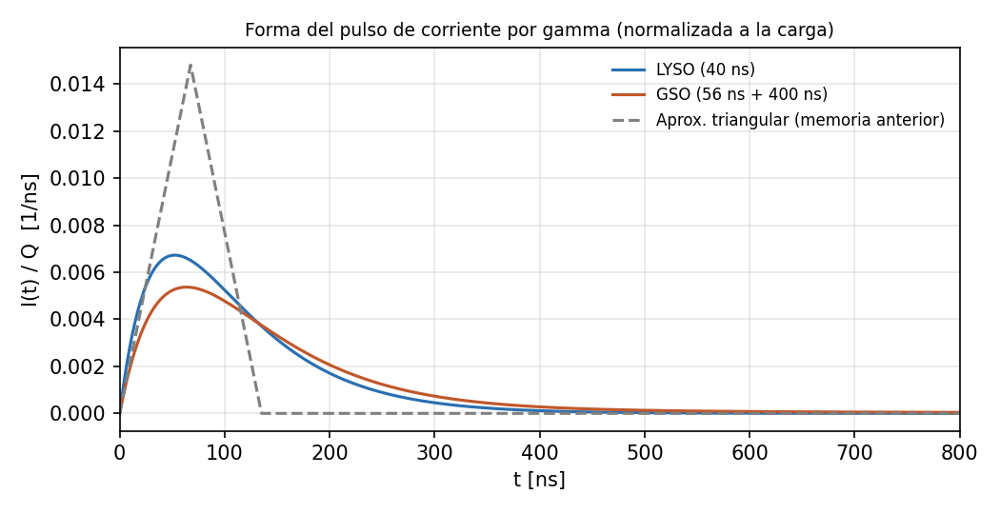

# Memoria de Cálculo: Amplitud del pulso por gamma y riesgo de saturación

*Revisión 2 — 23/09/2026. Reemplaza la versión basada en la doble etapa (TIA R5 = 500 Ω + inversor ×20) y solo en LYSO. Contexto y simulaciones: LOG 9.*

## 1. Objetivo

Estimar la corriente pico que entrega el SiPM ante un gamma de 511 keV, para **LYSO y GSO**, y determinar qué R_F del TIA de una etapa (Configuración C, ADA4895) evita la saturación.

## 2. Parámetros

| Parámetro | Valor | Fuente |
|---|---|---|
| Microceldas | 18 980 | Datasheet MICROC-SERIES |
| PDE (420 nm) | 31 % a V_ov = 2.5 V; 41 % a 5 V | Datasheet, Tabla 1 |
| Carga por avalancha | 0.48 pC (G = 3 × 10⁶, V_ov = 2.5 V) | Datasheet, Tabla 1 |
| Crosstalk | 7 % (2.5 V) | Datasheet, Tabla 1 |
| Recuperación de la celda τ_r | ≈ 71 ns | Modelo SPICE: R_q·(C_d + C_q) |
| LYSO | 32 000 fot/MeV, τ = 40 ns, 420 nm | Knoll T. 8.3 |
| GSO | 9 000 fot/MeV, τ = 56 ns (90 %) + 400 ns (10 %), 440 nm; PDE × 0.95 (estimado) | Knoll T. 8.3 |
| LCE (colección de luz) | 25 – 50 % | **Supuesto**, no medido |
| Excursión de salida disponible | 2.2 V sobre Uref = 2.5 V | ADA4895, 5 V single supply |

Se usa la carga del datasheet (0.48 pC). El modelo SPICE da ~0.40 pC (LOG 9, §6.3), así que la estimación es algo conservadora respecto de la saturación.

## 3. Cadena por gamma (absorción total de 511 keV)

  N_pe = 511 keV × LY × LCE × PDE
  N_aval = N_cells · (1 − e^(−N_pe / N_cells)) × (1 + crosstalk)
  Q = N_aval × 0.48 pC

## 4. Forma del pulso

La luz del centellador llega repartida en el tiempo y cada avalancha se recupera con τ_r. La corriente es la convolución de ambos decaimientos:

  I(t) = Q · [e^(−t/τ_r) − e^(−t/τ_s)] / (τ_r − τ_s)

| Cristal | Pico a | I_pk |
|---|---|---|
| LYSO | ~52 ns | Q / 149 ns |
| GSO | ~64 ns | Q / 186 ns |

La aproximación triangular de la versión anterior (base de 135 ns) **sobreestima el pico ~2.2×**.

## 5. Resultados (V_ov = 2.5 V)

| Cristal | LCE | Avalanchas | Q | I_pk | R_F para 1.2 V | R_F máx. (2.2 V) |
|---|---|---|---|---|---|---|
| LYSO | 25 % | ~1 310 | 0.63 nC | 4.2 mA | 283 Ω | 519 Ω |
| LYSO | 37.5 % | ~1 935 | 0.93 nC | 6.3 mA | 192 Ω | 352 Ω |
| LYSO | 50 % | ~2 540 | 1.22 nC | 8.2 mA | 146 Ω | 268 Ω |
| GSO | 25 % | ~360 | 0.17 nC | 0.93 mA | 1 296 Ω | 2 377 Ω |
| GSO | 37.5 % | ~540 | 0.26 nC | 1.38 mA | 868 Ω | 1 591 Ω |
| GSO | 50 % | ~710 | 0.34 nC | 1.84 mA | 654 Ω | 1 199 Ω |

- Hay un factor ~4.5 de diferencia de ganancia entre cristales y ~2 dentro de cada uno por la LCE.
- Ocupación de celdas: < 13 % (LYSO) y < 4 % (GSO), así que la no linealidad del SiPM es chica.
- **A V_ov = 5 V** la carga aumenta ~2.6× (ganancia ×2, PDE ×1.32, más crosstalk). La R_F necesaria se divide por el mismo factor. Si hace falta, se baja V_ov.

**Validación con el modelo SPICE:** la amplitud del SPE simulada coincide con I_pk = Q/τ_r × R_F dentro de ~5 % (por ejemplo, 2.65 mV simulados frente a 2.53 mV calculados con R_F = 220 Ω y V_ov = 4.5 V). El estudio del LOG 9 escaló la respuesta simulada a 511 keV y dio ventanas de R_F consistentes con esta tabla.

## 6. Conclusiones

1. **El circuito anterior saturaba:** con doble etapa y ganancia total 500 Ω × 20 = 10 kΩ, un gamma de LYSO pedía ~40–80 V de salida.
2. **Con una sola etapa, R_F tiene que ir de ~150 Ω (LYSO, mucha luz) a ~1.3 kΩ (GSO, poca luz)** para que el fotopico quede en ~1.2 V. Ninguna R_F fija cubre ambos cristales.
3. Esto justifica el banco de R_F con jumpers de la placa de evaluación (LOG 9, §7), que cubre ~160 Ω – 2.2 kΩ.
4. **Fondo de escala:** este cálculo pone el techo en el fotopico de 511 keV. Para medir pile-up (hasta ~1022 keV) hay que usar la configuración de ganancia siguiente, ~2× menor.

## 7. Limitaciones

- La LCE no está medida. Se resuelve midiendo el cociente fotopico/SPE en la placa.
- La carga por avalancha real está entre 0.40 pC (modelo) y 0.48 pC (datasheet).
- V_pk = I_pk × R_F es ideal. Con R_F alta, el ancho de banda del TIA lo reduce levemente (ver LOG 9).
- El PDE del GSO a 440 nm y el crosstalk a 5 V son estimaciones.

## Referencias

- onsemi, MICROC-SERIES/D (Tabla 1).
- Knoll, *Radiation Detection and Measurement*, Tabla 8.3.
- Torletti Daniluk (2025), §2.4.
- LOG 9 (23/09/2026) y script `escalado_spe_gamma.py`.
